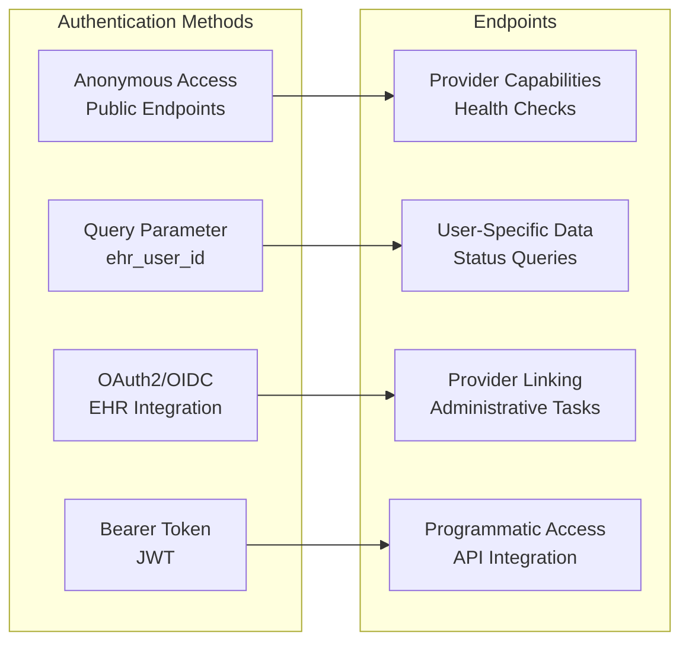
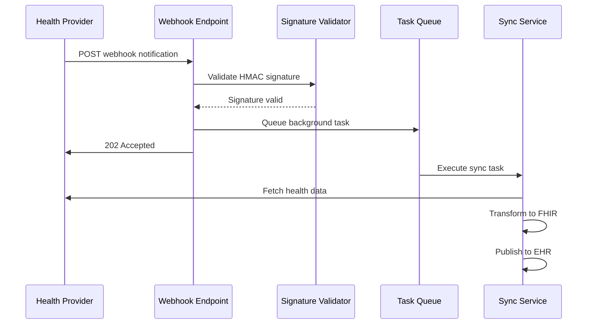
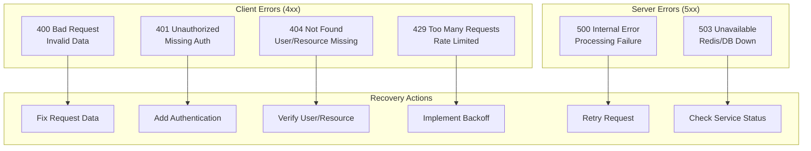

# API Documentation

## Overview

Open Health Exchange provides a RESTful API built with Django REST Framework. The API enables provider connections, health data synchronization monitoring, and device management for healthcare interoperability.

## Base URL and Versioning

```
Production: https://api.open-health-exchange.org
Development: http://localhost:8000
```

All API endpoints are prefixed with `/api/base/` for the main API and `/webhooks/` for webhook endpoints.

### API Versioning

The API uses Accept Header versioning (Django REST Framework `AcceptHeaderVersioning`). If no version is supplied the default version `1` is assumed.

Send the version using the `Accept` header parameter:

```http
Accept: application/json; version=1
```

If an unsupported version is requested, the API returns `406 Not Acceptable`.

## Authentication

### API Authentication Methods



### Required Headers

```http
Content-Type: application/json
Accept: application/json
```

### Optional Headers

```http
Authorization: Bearer <jwt_token>
X-Request-ID: <unique_request_id>
```

## Core API Endpoints

### Provider Management

#### List Providers

```http
GET /api/base/providers/
```

**Response:**
```json
{
  "count": 2,
  "next": null,
  "previous": null,
  "results": [
    {
      "id": 1,
      "name": "Withings",
      "provider_type": "withings",
      "active": true
    },
    {
      "id": 2,
      "name": "Fitbit",
      "provider_type": "fitbit",
      "active": true
    }
  ]
}
```

#### Get Provider Capabilities

```http
GET /api/base/providers/capabilities/
```

**Response:**
```json
{
  "supported_providers": ["withings", "fitbit"],
  "supported_data_types": [
    "heart_rate", "steps", "rr_intervals",
    "ecg", "blood_pressure", "weight"
  ],
  "webhook_endpoints": {
    "withings": "/webhooks/withings/",
    "fitbit": "/webhooks/fitbit/"
  },
  "sync_frequencies": {
    "real_time": "Webhook-triggered (immediate)",
    "daily": "Daily at 06:00 UTC",
    "weekly": "Weekly on Sundays at 06:00 UTC"
  }
}
```

### Health Data Synchronization

#### Get Sync Status

```http
GET /api/base/sync/status/?ehr_user_id={user_id}&provider={provider}
```

**Parameters:**
- `ehr_user_id` (required): EHR user identifier
- `provider` (optional): Specific provider (withings, fitbit)

**Response (Single Provider):**
```json
{
  "ehr_user_id": "user-12345",
  "provider": "withings",
  "status": "completed",
  "last_sync": "2023-12-07T10:30:00Z",
  "records_synced": 15,
  "errors": []
}
```

**Response (All Providers):**
```json
{
  "ehr_user_id": "user-12345",
  "providers": {
    "withings": {
      "status": "completed",
      "last_sync": "2023-12-07T10:30:00Z",
      "records_synced": 15,
      "errors": []
    },
    "fitbit": {
      "status": "no_recent_sync",
      "last_sync": null,
      "records_synced": null,
      "errors": []
    }
  }
}
```

#### Get Connected Providers

```http
GET /api/base/sync/providers/?ehr_user_id={user_id}
```

**Response:**
```json
{
  "ehr_user_id": "user-12345",
  "connected_providers": [
    {
      "id": 1,
      "provider": {
        "id": 1,
        "name": "Withings",
        "provider_type": "withings",
        "active": true
      },
      "external_user_id": "withings-user-67890"
    }
  ],
  "total_providers": 1
}
```

#### Trigger Device Sync

```http
POST /api/base/sync/trigger_device_sync/
Content-Type: application/json

{
  "ehr_user_id": "user-12345",
  "provider": "withings"
}
```

**Response:**
```json
{
  "message": "Device sync completed",
  "sync_id": "device-sync-20231207-103000",
  "ehr_user_id": "user-12345",
  "provider": "withings",
  "devices_processed": 2,
  "associations_created": 2,
  "success": true,
  "errors": []
}
```

### Provider Connection

#### Initiate Provider Linking

```http
GET /api/base/link/{provider}/?ehr_user_id={user_id}
```

**Parameters:**
- `provider` (required): Provider type (withings, fitbit)
- `ehr_user_id` (required): EHR user identifier

**Response:**
```http
HTTP/1.1 302 Found
Location: https://account.withings.com/oauth2/authorize?...
```

#### Check Provider Connection Status

```http
GET /api/base/link/{provider}/status/?ehr_user_id={user_id}
```

**Response:**
```json
{
  "ehr_user_id": "user-12345",
  "provider": "withings",
  "linked": true,
  "links": [
    {
      "provider_name": "Withings",
      "provider_type": "withings",
      "external_user_id": "withings-user-67890",
      "active": true,
      "linked_at": "2025-09-24T12:34:56Z"
    }
  ],
  "total_links": 1
}
```

`linked_at` is an ISO8601 UTC timestamp indicating when the provider link was originally created.

## Webhook Endpoints

### Webhook Architecture



### Withings Webhook

#### Endpoint Configuration

```http
POST /webhooks/withings/
Content-Type: application/json
X-Withings-Signature: sha256=<hmac_signature>
```

#### Webhook Verification

```http
GET /webhooks/withings/?challenge=<verification_string>
```

**Response:**
```
<verification_string>
```

#### Notification Payload

```json
{
  "userid": 12345,
  "appli": 4,
  "callbackurl": "https://api.open-health-exchange.org/webhooks/withings/",
  "comment": "user",
  "startdate": 1701942000,
  "enddate": 1701942600
}
```

#### Response

```json
{
  "status": "accepted",
  "provider": "withings",
  "sync_tasks_queued": 1,
  "timestamp": "2023-12-07T10:30:00Z"
}
```

### Fitbit Webhook

#### Endpoint Configuration

```http
POST /webhooks/fitbit/
Content-Type: application/json
X-Fitbit-Signature: <base64_hmac_signature>
```

#### Webhook Verification

```http
GET /webhooks/fitbit/?verify=<verification_code>
```

**Response:**
```http
HTTP/1.1 204 No Content
```

#### Notification Payload

```json
[
  {
    "collectionType": "activities",
    "date": "2023-12-07",
    "ownerId": "ABC123",
    "ownerType": "user",
    "subscriptionId": "1"
  }
]
```

#### Response

```json
{
  "status": "accepted",
  "provider": "fitbit",
  "sync_tasks_queued": 1,
  "timestamp": "2023-12-07T10:30:00Z"
}
```

## Health Check and Monitoring

### Application Health Check

```http
GET /api/metrics/health/
```

**Response (Healthy):**
```json
{
  "status": "healthy",
  "timestamp": 1733928600,
  "checks": {
    "database": {
      "status": "healthy",
      "response_time_ms": 2.5
    },
    "redis": {
      "status": "healthy",
      "response_time_ms": 1.2
    },
    "huey": {
      "status": "healthy",
      "response_time_ms": 1.8
    }
  },
  "response_time_ms": 5.5
}
```

**Response (Partially Unhealthy):**
```json
{
  "status": "unhealthy",
  "timestamp": 1733928600,
  "checks": {
    "database": {
      "status": "healthy",
      "response_time_ms": 2.5
    },
    "redis": {
      "status": "unhealthy",
      "error": "Connection refused"
    },
    "huey": {
      "status": "unhealthy",
      "error": "Redis dependency unavailable"
    }
  },
  "response_time_ms": 10.2
}
```

**HTTP Status Codes:**
- `200 OK`: All health checks passed
- `503 Service Unavailable`: One or more health checks failed

### Readiness Check (Kubernetes)

```http
GET /api/metrics/ready/
```

**Response (Ready):**
```json
{
  "ready": true,
  "checks": {
    "database": true,
    "redis": true
  }
}
```

**Response (Not Ready):**
```json
{
  "ready": false,
  "checks": {
    "database": true,
    "redis": false
  }
}
```

**HTTP Status Codes:**
- `200 OK`: Application is ready to serve traffic
- `503 Service Unavailable`: Application is not ready

### Liveness Check (Kubernetes)

```http
GET /api/metrics/live/
```

**Response:**
```json
{
  "alive": true,
  "timestamp": 1733928600
}
```

**HTTP Status Code:**
- `200 OK`: Application is alive and responding

### Prometheus Metrics

```http
GET /api/metrics/metrics/
```

**Response (Prometheus text format):**
```
# HELP ohe_sync_operations_total Total number of health data sync operations
# TYPE ohe_sync_operations_total counter
ohe_sync_operations_total{provider="withings",operation_type="heart_rate_fetch",status="success"} 1523.0
ohe_sync_operations_total{provider="fitbit",operation_type="activity_fetch",status="success"} 892.0
ohe_sync_operations_total{provider="withings",operation_type="weight_fetch",status="error"} 12.0

# HELP ohe_sync_duration_seconds Time spent on health data sync operations
# TYPE ohe_sync_duration_seconds histogram
ohe_sync_duration_seconds_bucket{provider="withings",operation_type="heart_rate_fetch",le="0.1"} 523.0
ohe_sync_duration_seconds_bucket{provider="withings",operation_type="heart_rate_fetch",le="0.5"} 1201.0
ohe_sync_duration_seconds_bucket{provider="withings",operation_type="heart_rate_fetch",le="1.0"} 1450.0

# HELP ohe_data_points_processed_total Total number of health data points processed
# TYPE ohe_data_points_processed_total counter
ohe_data_points_processed_total{provider="withings",data_type="heart_rate"} 45230.0
ohe_data_points_processed_total{provider="fitbit",data_type="steps"} 28901.0

# HELP ohe_api_requests_total Total number of API requests
# TYPE ohe_api_requests_total counter
ohe_api_requests_total{method="GET",endpoint="api/base/providers",status_code="200"} 234.0
ohe_api_requests_total{method="POST",endpoint="webhooks/withings",status_code="202"} 892.0

# HELP ohe_provider_api_errors_total Total number of provider API errors
# TYPE ohe_provider_api_errors_total counter
ohe_provider_api_errors_total{provider="withings",error_type="rate_limit_error"} 5.0
ohe_provider_api_errors_total{provider="fitbit",error_type="auth_error"} 3.0
```

### Webhook Health Check

```http
GET /webhooks/health/
```

**Response (Healthy):**
```json
{
  "status": "healthy",
  "timestamp": "2023-12-07T10:30:00Z",
  "services": {
    "database": "healthy",
    "redis": "healthy",
    "task_queue": "healthy"
  },
  "version": "2.0.0"
}
```

**Response (Unhealthy):**
```json
{
  "status": "unhealthy",
  "timestamp": "2023-12-07T10:30:00Z",
  "error": "Redis connection failed",
  "services": {
    "database": "healthy",
    "redis": "unhealthy",
    "task_queue": "unhealthy"
  }
}
```

### Webhook Metrics

```http
GET /webhooks/metrics/
```

**Response:**
```json
{
  "webhook_metrics": {
    "total_requests": 1543,
    "successful_requests": 1521,
    "failed_requests": 22,
    "average_response_time_ms": 45.2
  },
  "endpoints": {
    "withings": {
      "requests": 892,
      "success_rate": 98.4,
      "avg_response_time_ms": 42.1
    },
    "fitbit": {
      "requests": 651,
      "success_rate": 96.7,
      "avg_response_time_ms": 49.3
    }
  },
  "provider_notifications": {
    "withings": 892,
    "fitbit": 651
  },
  "sync_tasks_queued": 1543,
  "last_updated": "2023-12-07T10:30:00Z"
}
```

## Error Handling

### HTTP Status Codes

| Status Code | Meaning | Usage |
|-------------|---------|-------|
| 200 | OK | Successful GET requests |
| 201 | Created | Successful POST requests |
| 202 | Accepted | Webhook notifications accepted |
| 204 | No Content | Successful DELETE or webhook verification |
| 400 | Bad Request | Invalid request data |
| 401 | Unauthorized | Authentication required |
| 403 | Forbidden | Insufficient permissions |
| 404 | Not Found | Resource not found |
| 429 | Too Many Requests | Rate limit exceeded |
| 500 | Internal Server Error | Server error |
| 503 | Service Unavailable | Service temporarily unavailable |

### Error Response Format

```json
{
  "error": "validation_error",
  "message": "Invalid request data",
  "details": {
    "ehr_user_id": [
      "This field is required."
    ],
    "provider": [
      "Invalid choice: 'invalid_provider'"
    ]
  },
  "timestamp": "2023-12-07T10:30:00Z",
  "request_id": "req-12345-67890"
}
```

### Common Error Scenarios



## Rate Limiting

### Rate Limit Headers

```http
X-RateLimit-Limit: 100
X-RateLimit-Remaining: 95
X-RateLimit-Reset: 1701942660
```

### Rate Limit Configuration

| Endpoint Category | Limit | Window | Scope |
|------------------|-------|---------|-------|
| Provider Info | 100 req/min | Per IP | Anonymous |
| User Sync Status | 60 req/min | Per User | Authenticated |
| Device Sync | 10 req/min | Per User | Authenticated |
| Webhook Endpoints | 1000 req/min | Per Provider | IP-based |

### Rate Limit Exceeded Response

```http
HTTP/1.1 429 Too Many Requests
X-RateLimit-Limit: 100
X-RateLimit-Remaining: 0
X-RateLimit-Reset: 1701942720
Retry-After: 60

{
  "error": "rate_limit_exceeded",
  "message": "Rate limit exceeded",
  "limit": 100,
  "window_seconds": 60,
  "retry_after": 60
}
```

## Request/Response Examples

### Complete Provider Connection Flow

```bash
# 1. Check provider capabilities
curl -X GET "https://api.open-health-exchange.org/api/base/providers/capabilities/"

# 2. Initiate provider connection
curl -X GET "https://api.open-health-exchange.org/api/base/link/withings/?ehr_user_id=user-12345"
# -> Returns OAuth2 redirect URL

# 3. After OAuth completion, check connection status
curl -X GET "https://api.open-health-exchange.org/api/base/link/withings/status/?ehr_user_id=user-12345"

# 4. Trigger initial device sync
curl -X POST "https://api.open-health-exchange.org/api/base/sync/trigger_device_sync/" \
  -H "Content-Type: application/json" \
  -d '{
    "ehr_user_id": "user-12345",
    "provider": "withings"
  }'

# 5. Check sync status
curl -X GET "https://api.open-health-exchange.org/api/base/sync/status/?ehr_user_id=user-12345&provider=withings"
```

### Webhook Testing

```bash
# Test webhook endpoint (development)
curl -X POST "http://localhost:8000/webhooks/withings/" \
  -H "Content-Type: application/json" \
  -H "X-Withings-Signature: sha256=test_signature" \
  -d '{
    "userid": 12345,
    "appli": 4,
    "callbackurl": "http://localhost:8000/webhooks/withings/",
    "comment": "user",
    "startdate": 1701942000,
    "enddate": 1701942600
  }'
```

## SDK and Integration Examples

### Python Integration

```python
import requests

class OpenHealthExchangeClient:
    def __init__(self, base_url="https://api.open-health-exchange.org"):
        self.base_url = base_url
        self.session = requests.Session()

    def get_provider_capabilities(self):
        """Get supported providers and capabilities"""
        response = self.session.get(f"{self.base_url}/api/base/providers/capabilities/")
        return response.json()

    def initiate_provider_connection(self, provider, ehr_user_id):
        """Start OAuth flow for provider connection"""
        response = self.session.get(
            f"{self.base_url}/api/base/link/{provider}/",
            params={"ehr_user_id": ehr_user_id},
            allow_redirects=False
        )
        return response.headers.get("Location")

    def get_sync_status(self, ehr_user_id, provider=None):
        """Get synchronization status"""
        params = {"ehr_user_id": ehr_user_id}
        if provider:
            params["provider"] = provider

        response = self.session.get(
            f"{self.base_url}/api/base/sync/status/",
            params=params
        )
        return response.json()

    def trigger_device_sync(self, ehr_user_id, provider):
        """Trigger manual device synchronization"""
        response = self.session.post(
            f"{self.base_url}/api/base/sync/trigger_device_sync/",
            json={
                "ehr_user_id": ehr_user_id,
                "provider": provider
            }
        )
        return response.json()

# Usage example
client = OpenHealthExchangeClient()

# Get capabilities
capabilities = client.get_provider_capabilities()
print(f"Supported providers: {capabilities['supported_providers']}")

# Initiate connection
oauth_url = client.initiate_provider_connection("withings", "user-12345")
print(f"Complete OAuth at: {oauth_url}")

# Check status
status = client.get_sync_status("user-12345", "withings")
print(f"Sync status: {status['status']}")
```

### JavaScript/Node.js Integration

```javascript
class OpenHealthExchangeClient {
  constructor(baseUrl = 'https://api.open-health-exchange.org') {
    this.baseUrl = baseUrl;
  }

  async getProviderCapabilities() {
    const response = await fetch(`${this.baseUrl}/api/base/providers/capabilities/`);
    return response.json();
  }

  async initiateProviderConnection(provider, ehrUserId) {
    const response = await fetch(
      `${this.baseUrl}/api/base/link/${provider}/?ehr_user_id=${ehrUserId}`,
      { redirect: 'manual' }
    );
    return response.headers.get('location');
  }

  async getSyncStatus(ehrUserId, provider = null) {
    const params = new URLSearchParams({ ehr_user_id: ehrUserId });
    if (provider) params.append('provider', provider);

    const response = await fetch(`${this.baseUrl}/api/base/sync/status/?${params}`);
    return response.json();
  }

  async triggerDeviceSync(ehrUserId, provider) {
    const response = await fetch(`${this.baseUrl}/api/base/sync/trigger_device_sync/`, {
      method: 'POST',
      headers: { 'Content-Type': 'application/json' },
      body: JSON.stringify({
        ehr_user_id: ehrUserId,
        provider: provider
      })
    });
    return response.json();
  }
}

// Usage
const client = new OpenHealthExchangeClient();

(async () => {
  const capabilities = await client.getProviderCapabilities();
  console.log('Supported providers:', capabilities.supported_providers);

  const oauthUrl = await client.initiateProviderConnection('fitbit', 'user-12345');
  console.log('Complete OAuth at:', oauthUrl);
})();
```

This API documentation provides comprehensive guidance for integrating with the Open Health Exchange platform, covering all endpoints, authentication methods, and integration patterns.