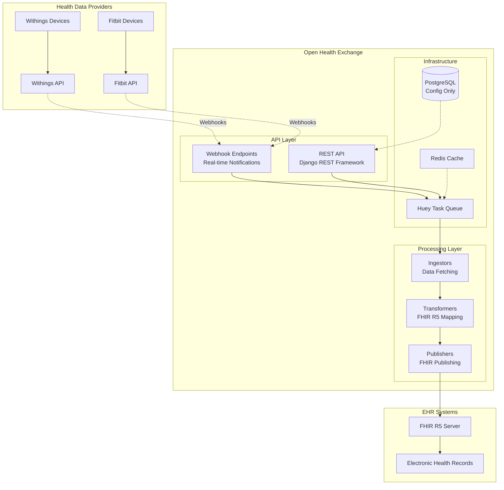
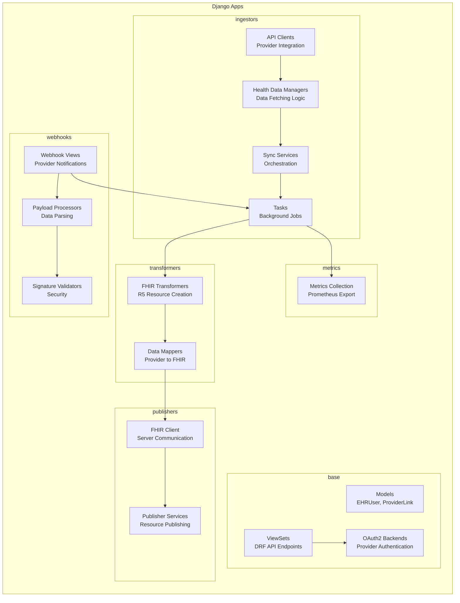
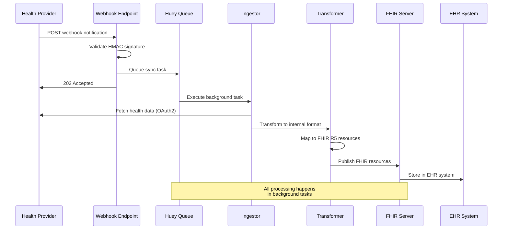
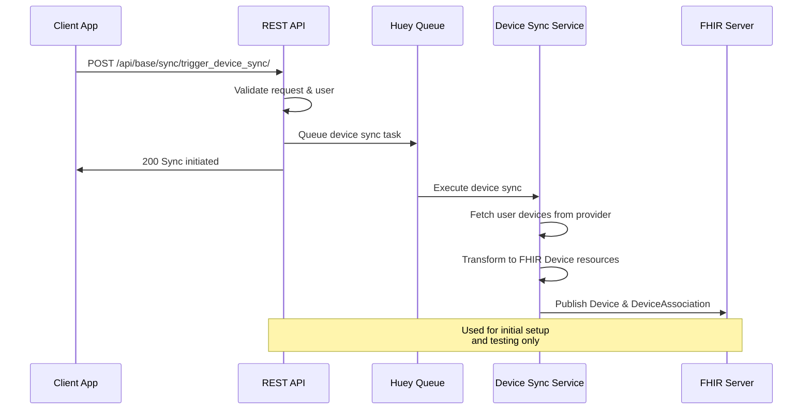
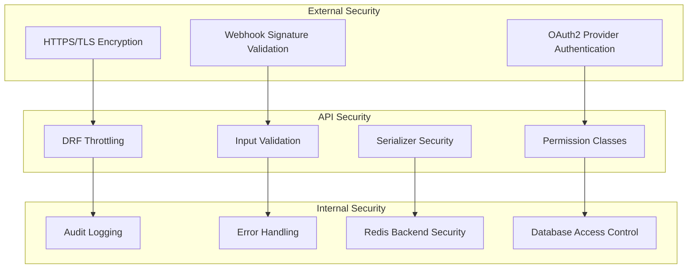
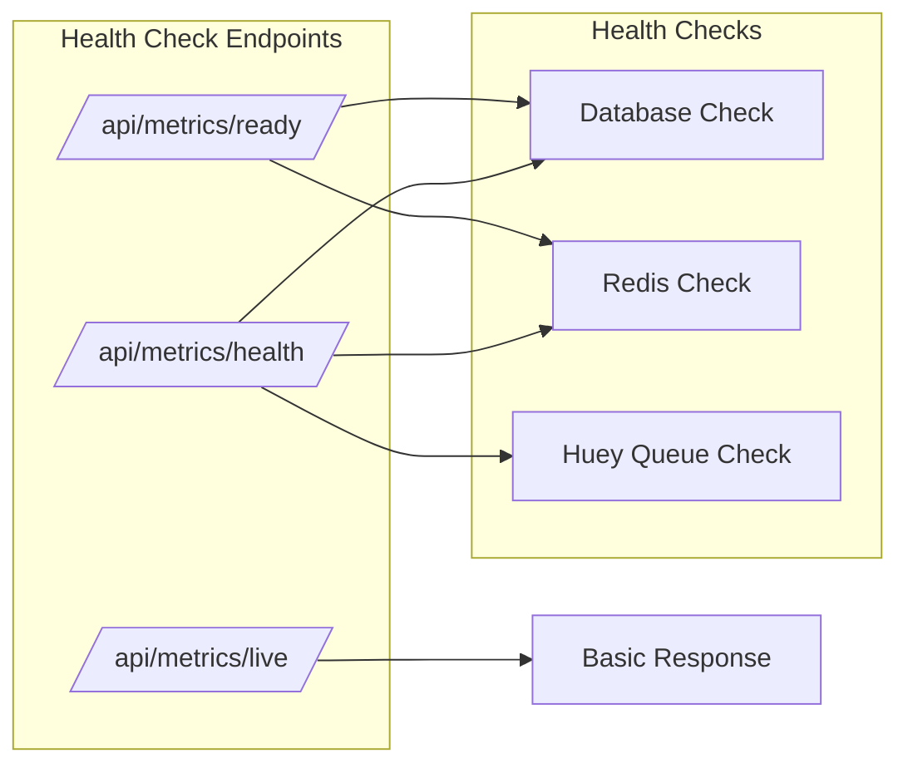
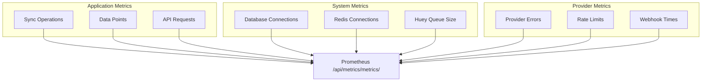
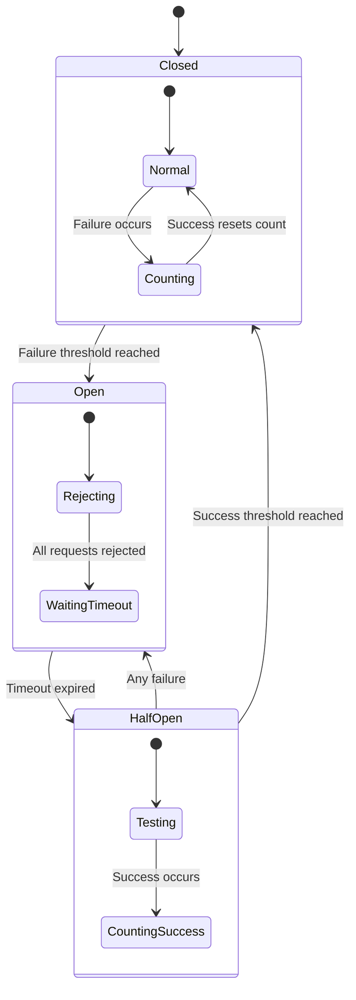
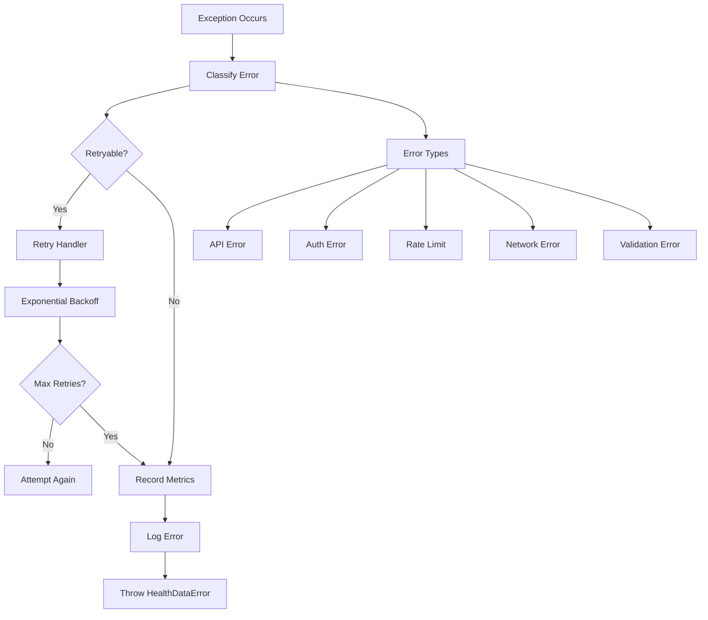

# Open Health Exchange - Architecture Documentation

## System Overview

Open Health Exchange is a Django-based microservice that acts as a bridge between personal health data providers (wearables, health apps) and FHIR R5-compliant Electronic Health Record (EHR) systems. The system operates as a data transformer and relay without persistent health data storage.



## Core Architecture Principles

### 1. **Stateless Data Processing**
- No persistent storage of raw physiological measurements (only transient processing)
    - Stored: provider link metadata, OAuth tokens, minimal sync bookkeeping
    - Not Stored: raw heart rate series, ECG waveforms, step samples, weight values
- Configuration and metadata only in database
- Real-time transformation and forwarding

### 2. **Event-Driven Architecture**
- Webhook-triggered data synchronization
- Background task processing via Huey
- Minimal manual intervention required

### 3. **FHIR R5 Compliance**
- Native FHIR resource generation
- LOINC and SNOMED CT coding
- Healthcare interoperability standards

### 4. **Provider Agnostic Design**
- Standardized internal data models
- Provider-specific adapters
- Extensible to new health data sources

## Component Architecture



## Data Flow Architecture

### Real-Time Webhook Flow



### Manual Device Sync Flow



## Security Architecture



## Deployment Architecture

```mermaid
graph TB
    subgraph "Load Balancer"
        LB[nginx/HAProxy]
    end

    subgraph "Application Tier"
        subgraph "Web Instances"
            W1[Django Instance 1]
            W2[Django Instance 2]
            WN[Django Instance N]
        end

        subgraph "Worker Instances"
            H1[Huey Worker 1]
            H2[Huey Worker 2]
            HN[Huey Worker N]
        end
    end

    subgraph "Data Tier"
    R[(Valkey / Redis Service)<br/>Task Queue & Cache]
        P[(PostgreSQL<br/>Configuration Data)]
    end

    subgraph "External Services"
        WA[Withings API]
        FA[Fitbit API]
        FS[FHIR Server]
    end

    LB --> W1
    LB --> W2
    LB --> WN

    W1 --> R
    W2 --> R
    WN --> R

    W1 --> P
    W2 --> P
    WN --> P

    H1 --> R
    H2 --> R
    HN --> R

    H1 --> P
    H2 --> P
    HN --> P

    H1 --> WA
    H1 --> FA
    H1 --> FS

    H2 --> WA
    H2 --> FA
    H2 --> FS

    HN --> WA
    HN --> FA
    HN --> FS
```

## Technology Stack

### Core Framework
- **Django 5.2**: Web framework with ORM
- **Django REST Framework**: API framework with ViewSets
- **Python 3.13+**: Modern Python features

### Data Processing
- **Huey**: Background task queue with Redis
- **Redis**: Caching and task queue backend
- **PostgreSQL**: Configuration and metadata storage

### Health Data Integration
- **python-social-auth**: OAuth2 provider integration
- **withings-api**: Withings API client library
- **fitbit**: Fitbit API client library
- **fhirpy**: FHIR R5 client library

### Production Infrastructure
- **Daphne**: ASGI server for Django
- **nginx**: Reverse proxy and load balancer
- **Kubernetes**: Container orchestration
- **Prometheus**: Metrics collection

## Scalability Considerations

### Horizontal Scaling
- **Stateless Design**: No session storage, cache-backed
- **Worker Scaling**: Independent Huey worker scaling
- **Database Optimization**: Minimal database usage
- **Redis / Valkey**: Deploy single instance, HA, or managed cluster as required

### Performance Optimization
- **Background Processing**: Non-blocking webhook responses
- **Connection Pooling**: Efficient database connections
- **Rate Limiting**: Provider API quota management
- **Caching Strategy**: Redis-based caching

### Monitoring and Observability (Phase 3)

#### Health Check System


- **Comprehensive Health**: `/api/metrics/health/` checks all dependencies
- **Readiness Probe**: `/api/metrics/ready/` for Kubernetes deployments
- **Liveness Probe**: `/api/metrics/live/` for container orchestration
- **Response Times**: Measured for each component check

#### Prometheus Metrics



##### Collected Metrics
- `ohe_sync_operations_total`: Count of sync operations by provider, type, and status
- `ohe_sync_duration_seconds`: Histogram of sync operation durations
- `ohe_data_points_processed_total`: Count of health data points by provider and type
- `ohe_fhir_operations_total`: FHIR server operations by type and resource
- `ohe_api_requests_total`: API requests by method, endpoint, and status
- `ohe_webhook_requests_total`: Webhook requests by provider
- `ohe_provider_api_errors_total`: Provider API errors by type
- `ohe_provider_api_rate_limits_total`: Rate limit hits by provider

#### Circuit Breaker Architecture



- **Withings Circuit Breaker**: 3 failures to open, 30s timeout (2 successes to fully close)
- **Fitbit Circuit Breaker**: 3 failures to open, 30s timeout (2 successes to fully close)
- **FHIR Circuit Breaker**: 5 failures to open, 60s timeout (3 successes to fully close)
- **Automatic Recovery**: Half-open state tests service availability

##### Operational Notes

Circuit breakers are implemented in `ingestors.circuit_breaker` and applied via decorators in `ingestors.api_clients` to outbound provider API calls. They prevent cascading failures when an upstream provider or the FHIR server experiences sustained errors.

Key behaviors:
1. Failure counts increment only for classified retryable provider/API failures.
2. When the configured failure threshold is reached, the breaker opens and short-circuits further calls (fast-fail) until the timeout expires.
3. After timeout, a half-open trial phase allows limited test calls; required consecutive successes transition the breaker back to closed.
4. Any failure during half-open immediately re-opens the breaker and resets the timeout window.

Introspection support is available through the breaker registry:

```python
from ingestors.circuit_breaker import registry

states = registry.get_all_states()
for name, info in states.items():
    print(name, info["state"], info["failure_count"], info["opened_at"])

# Force close (administrative override – use sparingly)
registry.get_breaker("withings_api").force_close()
```

Planned enhancements (future):
- Export dedicated Prometheus gauges (e.g. `ohe_circuit_breaker_state{breaker="withings_api"}`)
- Management command or admin UI actions to reset breakers
- Optional exponential backoff policy integration for half-open probes

#### Error Handling Strategy



- **Error Classification**: Automatic categorization of errors
- **Retry Logic**: Configurable retry with exponential backoff
- **Metrics Recording**: All errors tracked in Prometheus
- **Contextual Logging**: Structured logs with error context

#### Structured Logging (see [logging](logging.md) for configuration details)

```json
{
  "timestamp": "2025-09-24T10:15:30Z",
  "level": "ERROR",
  "logger": "ingestors.api_clients",
  "message": "Failed to fetch health data",
  "user_id": "user123",
  "provider": "withings",
  "operation": "heart_rate_fetch",
  "duration": 1.234,
  "error_type": "rate_limit_error",
  "traceback": ["..."]
}
```

- **JSON Format**: Production logs in structured JSON
- **Middleware Integration**: Automatic request/response logging
- **Context Enrichment**: User, provider, operation details
- **Performance Tracking**: Duration metrics in logs

## Integration Patterns

### Provider Integration
1. **OAuth2 Registration**: User authorizes provider access
2. **Webhook Subscription**: Register for real-time notifications
3. **Data Synchronization**: Background fetch and transform
4. **Error Recovery**: Retry logic and fallback mechanisms

### FHIR Integration
1. **Resource Mapping**: Provider data to FHIR R5 resources
2. **Identifier Management**: Consistent resource identification
3. **Reference Resolution**: Patient and device relationships
4. **Validation**: FHIR resource validation before publishing

### EHR Integration
1. **Authentication**: OAuth2/JWT with FHIR servers
2. **Resource Publishing**: RESTful FHIR API calls
3. **Duplicate Detection**: Prevent data duplication
4. **Error Handling**: Graceful failure management

## Health Data Sync Architecture

### Overview
The health data synchronization system provides comprehensive data flow management from third-party providers to FHIR R5 EHR systems, supporting multiple sync triggers and data aggregation strategies.

### Core Sync Requirements

1. **Sync Triggers**: Initial sync, push notifications, incremental updates
2. **Data Types**: Heart rate, steps, RR intervals, ECG measurements, vitals
3. **Granularity**: Individual records OR hourly aggregation (configurable)
4. **Special Rules**: RR and ECG measurements always include heart rate data
5. **FHIR R5 Compliance**: Proper Observation, DiagnosticReport resources

### Sync Strategy Architecture

#### SyncStrategy Interface
```python
class SyncStrategy(Protocol):
    def get_sync_params(
        self,
        user_id: str,
        data_types: list[HealthDataType],
        last_sync: datetime | None = None
    ) -> dict[str, Any]
```

#### Strategy Implementations

**InitialSyncStrategy**: Full historical data pull (configurable timeframe)
- Lookback period: 30 days (configurable)
- Large batch sizes for efficiency
- Complete data retrieval for new users

**IncrementalSyncStrategy**: Delta sync from last successful sync
- Small overlap period for timezone handling
- Efficient updates for existing data
- Optimized for regular maintenance

**PushNotificationSyncStrategy**: Real-time triggered sync
- 15-minute lookback window
- High priority processing
- Small batches for immediate response

### Data Type Handler Architecture

#### Specialized Ingestors
- **HeartRateIngestor**: Heart rate measurements with timestamps
- **StepsIngestor**: Step count data with activity periods
- **RRIngestor**: RR interval data (always linked to heart rate)
- **ECGIngestor**: ECG waveform data (always linked to heart rate)
- **VitalsIngestor**: Blood pressure, weight, temperature, SpO2

#### Linked Data Processing
Special handling for data types that require linked measurements:
- **ECG measurements** → Always include corresponding heart rate data
- **RR intervals** → Always include baseline heart rate measurements
- **Diagnostic reports** → Bundle related observations

### Aggregation Engine Architecture

#### HourlyAggregator
Concatenates individual measurements into hourly summaries:
- **Statistical aggregation**: Min, max, average, count
- **Metadata preservation**: Source record counts, aggregation type
- **Time window handling**: Proper hour boundary alignment

#### Configuration-Driven Processing
```python
@dataclass
class HealthSyncConfig:
    user_id: str
    enabled_data_types: list[HealthDataType]
    aggregation_preference: AggregationLevel  # INDIVIDUAL | HOURLY
    sync_frequency: SyncFrequency  # REALTIME | HOURLY | DAILY
    retention_period: timedelta
    linked_data_rules: dict[HealthDataType, list[HealthDataType]] | None = None
```

### FHIR Transformation Architecture

#### Resource Mapping Standards
- **Heart Rate** → `Observation` (LOINC: 8867-4)
- **Steps** → `Observation` (LOINC: 55423-8)
- **RR Intervals** → `Observation` (LOINC: 8637-1) + linked heart rate
- **ECG** → `DiagnosticReport` (LOINC: 11524-6) + linked heart rate
- **Blood Pressure** → `Observation` (LOINC: 85354-9)

#### Transformation Pipeline
```python
class HealthDataTransformer:
    def transform_to_fhir(
        self,
        records: list[HealthDataRecord],
        aggregation_config: AggregationConfig,
        patient_reference: str,
        device_reference: str
    ) -> list[FHIRResource]
```

### Sync Flow Examples

#### Initial Sync Flow
```
User Registration → InitialSyncStrategy → HealthDataManager.fetch_health_data()
→ [HeartRate, Steps, Vitals] → AggregationEngine (hourly)
→ FHIR Observations → BatchProcessor → EHR System
```

#### Push Notification Flow
```
Provider Webhook → PushNotificationSyncStrategy → IncrementalSync
→ [New Measurements] → IndividualRecordTransformer
→ FHIR Resources → DeduplicationService → EHR System
```

#### ECG with Heart Rate Flow
```
ECG Measurement → ECGIngestor → LinkedDataTransformer
→ DiagnosticReport (ECG) + Observation (Heart Rate)
→ Linked FHIR Resources → EHR System
```

### Task Scheduling Architecture

#### Huey Task Integration
```python
@HUEY.task(priority=1)  # High priority for real-time
def sync_user_health_data_realtime(user_id: str, provider_name: str, data_types: list[str])

@HUEY.task(priority=3)  # Medium priority for scheduled
def sync_user_health_data_incremental(user_id: str, provider: str)

@HUEY.periodic_task(crontab(hour="3", minute="0"), priority=5)  # Low priority for nightly
def nightly_health_data_reconciliation()
```

#### Webhook Handler Integration
```python
@api_view(['POST'])
def handle_withings_webhook(request):
    # Validate webhook signature
    # Extract user_id and data_types from payload
    # Queue real-time sync task
    sync_user_health_data_realtime(user_id, 'withings', data_types, 'webhook')
```

### Data Storage Strategy

#### Temporary Data Staging
- **Raw provider data**: Temporarily stored for transformation
- **Failed sync attempts**: Queued for retry with exponential backoff
- **Audit trail**: Complete sync operation history

#### FHIR Resource Management
- **No permanent health data storage**: Pass-through transformation only
- **Metadata tracking**: Last sync timestamps, resource IDs, sync status
- **Deduplication cache**: Temporary hashes for conflict detection

### Organization-Level Policies
```python
@dataclass
class OrganizationSyncPolicy:
    org_id: str
    allowed_data_types: list[HealthDataType]
    default_aggregation: AggregationLevel
    max_retention_period: timedelta
    required_linked_data: dict[HealthDataType, list[HealthDataType]]
    # Example: {ECG: [HEART_RATE], RR_INTERVALS: [HEART_RATE]}
```

### Security and Privacy Architecture

#### Data Handling Security
- **Encryption in transit**: All API communications use TLS 1.3
- **Minimal data retention**: Configurable staging period (max 24 hours)
- **Audit logging**: Complete data access and transformation logs
- **HIPAA compliance**: Privacy and security rule adherence

#### Access Control Framework
- **User consent tracking**: Granular permissions per data type
- **Provider-specific permissions**: OAuth scope validation
- **Organization policy enforcement**: Automated compliance checking

---

## Related Documentation

- **[Code Examples](examples.md)** - Comprehensive implementation examples for sync strategies, FHIR transformations, and aggregation patterns
- **[FHIR Mappings](fhir-mappings.md)** - Detailed LOINC code mappings and FHIR resource structures
- **[API Documentation](api-documentation.md)** - Complete REST API reference
- **[Deployment Guide](deployment-guide.md)** - Production deployment instructions
- **[Monitoring Operations Guide](monitoring-operations-guide.md)** - Observability and troubleshooting