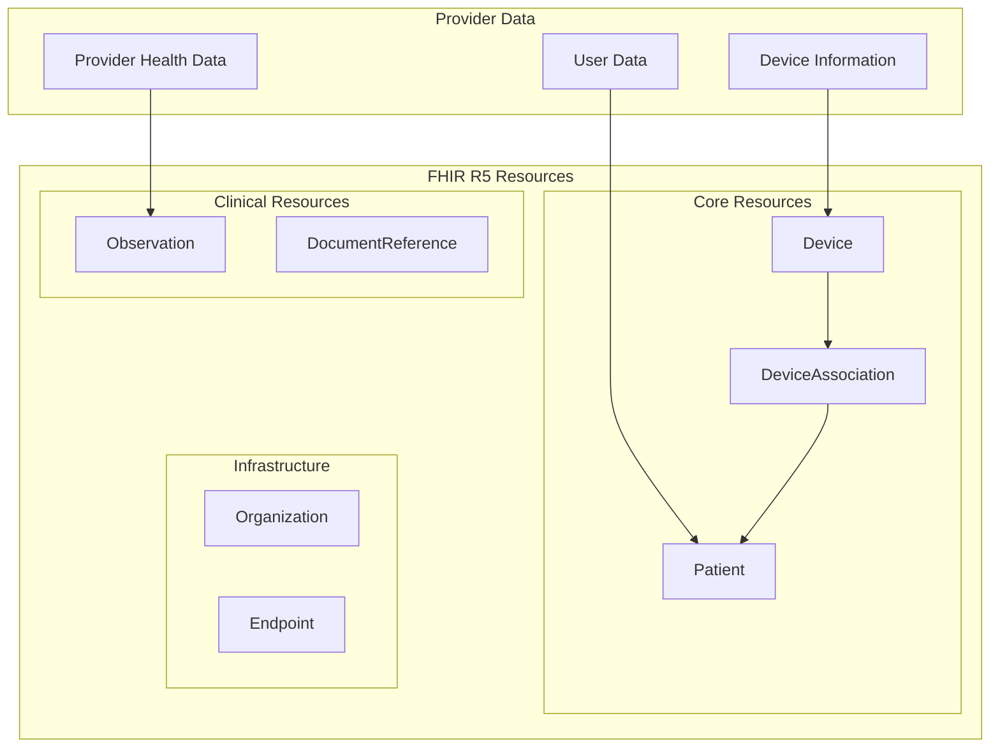
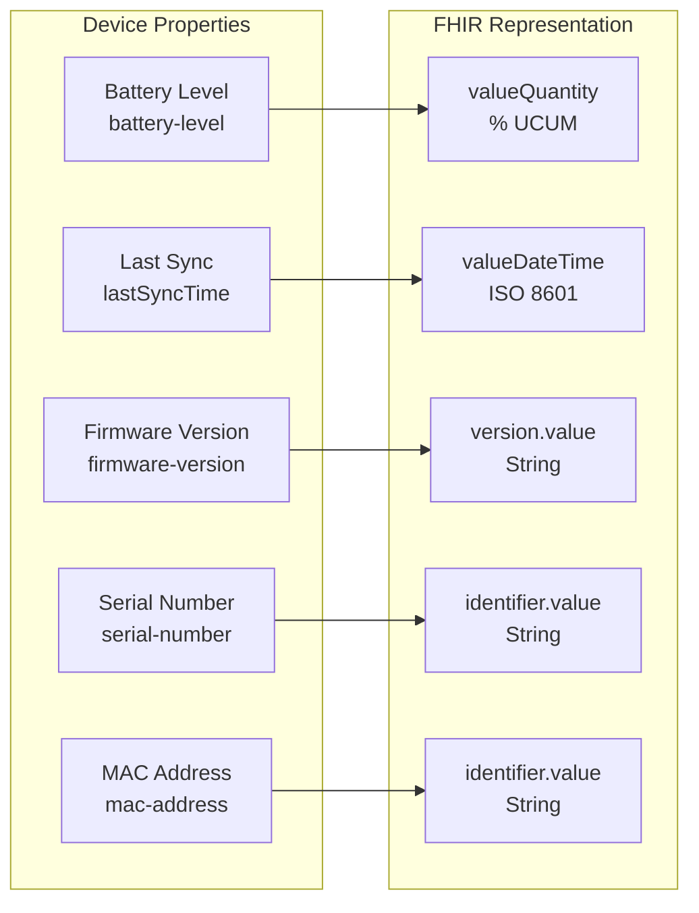
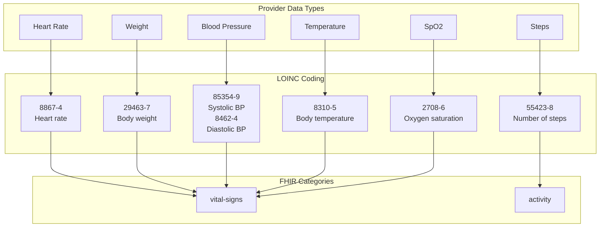
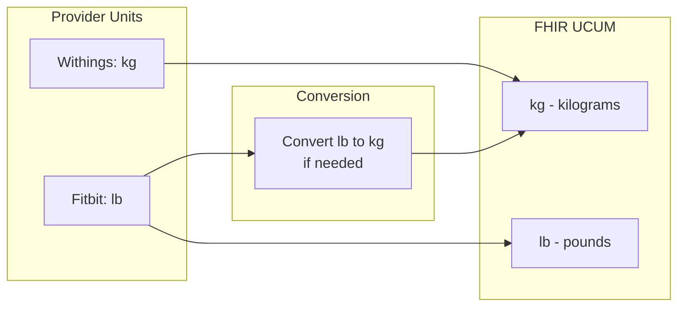
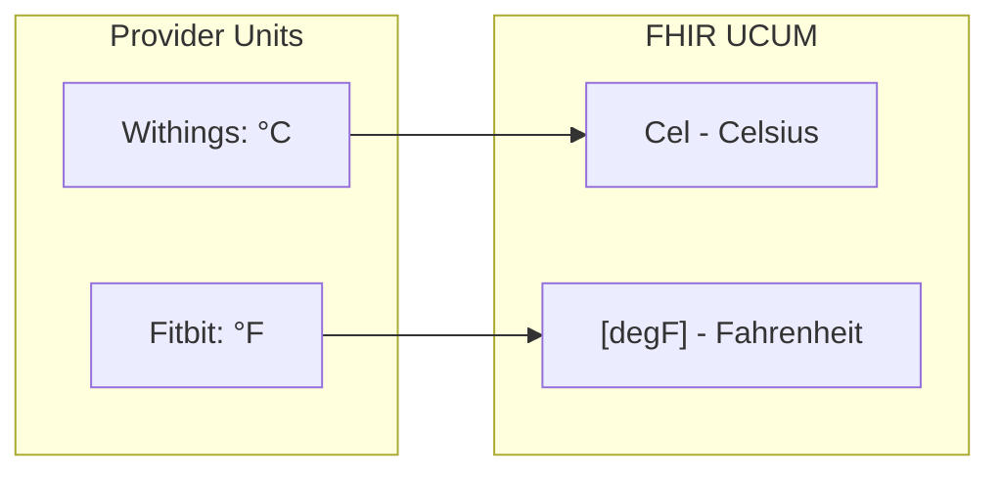
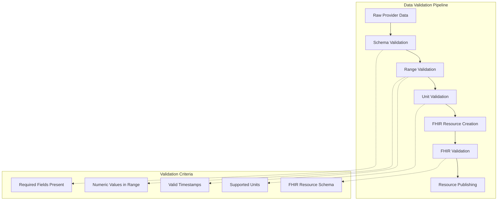
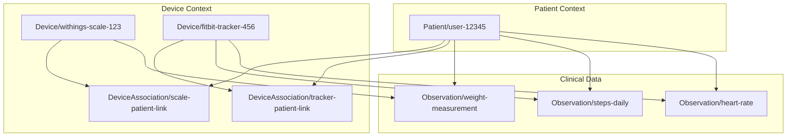
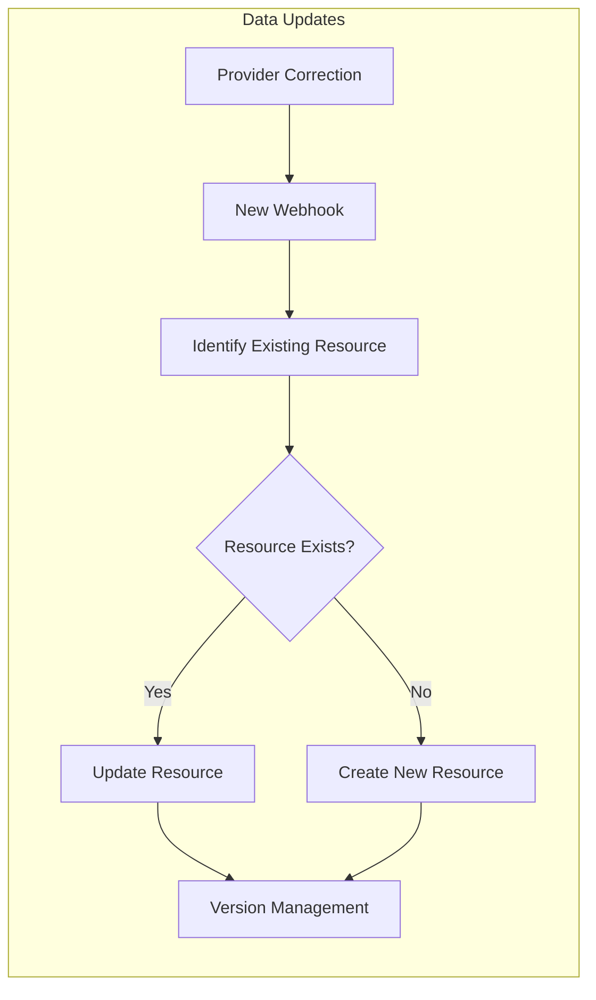

# FHIR R5 Mappings and Transformations

## Overview

Open Health Exchange transforms health data from various providers into FHIR R5-compliant resources. This document details the mapping specifications, coding systems, and transformation rules used to ensure healthcare interoperability.

## FHIR Resource Types



## Device Resources

### Device Resource Mapping

FHIR Device resources represent physical health monitoring devices and their capabilities.

```json
{
  "resourceType": "Device",
  "id": "withings-scale-12345",
  "identifier": [
    {
      "use": "official",
      "system": "https://api.withings.com/device-id",
      "value": "12345",
      "assigner": {
        "display": "Withings Health Platform"
      }
    }
  ],
  "status": "active",
  "manufacturer": "Withings",
  "name": "Body+ Scale",
  "displayName": "Body+ Scale",
  "deviceName": [
    {
      "value": "Body+ Scale"
    }
  ],
  "type": [
    {
      "coding": [
        {
          "system": "http://snomed.info/sct",
          "code": "19892000",
          "display": "Scale"
        }
      ],
      "text": "Scale"
    }
  ],
  "version": [
    {
      "type": {
        "coding": [
          {
            "system": "http://terminology.hl7.org/CodeSystem/device-version-type",
            "code": "firmware-version",
            "display": "Firmware Version"
          }
        ]
      },
      "value": "2.1.0"
    }
  ],
  "property": [
    {
      "type": {
        "coding": [
          {
            "system": "http://terminology.hl7.org/CodeSystem/device-property-type",
            "code": "battery-level",
            "display": "Battery Level"
          }
        ]
      },
      "valueQuantity": {
        "value": 85,
        "unit": "%",
        "system": "http://unitsofmeasure.org",
        "code": "%"
      }
    }
  ],
  "safety": [
    {
      "coding": [
        {
          "system": "urn:oid:2.16.840.1.113883.3.26.1.1",
          "code": "mr-unsafe",
          "display": "MR Unsafe"
        }
      ]
    }
  ],
  "note": [
    {
      "time": "2023-12-07T10:30:00Z",
      "text": "Device synchronized from Withings Health Platform"
    }
  ]
}
```

### SNOMED CT Device Type Mappings

| Device Type | SNOMED CT Code | Display Name | Providers |
|-------------|----------------|--------------|-----------|
| Blood Pressure Monitor | 43770009 | Sphygmomanometer | Withings |
| Body Scale | 19892000 | Scale | Withings, Fitbit |
| Activity Tracker | 466093008 | Activity tracker | Withings, Fitbit |
| Smartwatch | 706767009 | Wearable device | Withings, Fitbit |
| Thermometer | 86184003 | Thermometer | Withings |
| Pulse Oximeter | 258185003 | Pulse oximeter | Fitbit |
| Unknown Device | 49062001 | Device | All (fallback) |

### Device Property Types



## DeviceAssociation Resources

DeviceAssociation resources link devices to patients and define the relationship context.

```json
{
  "resourceType": "DeviceAssociation",
  "id": "withings-scale-12345-patient-67890",
  "identifier": [
    {
      "use": "official",
      "system": "https://api.withings.com/device-association",
      "value": "12345-association",
      "assigner": {
        "display": "Withings Health Platform"
      }
    }
  ],
  "device": {
    "reference": "Device/withings-scale-12345"
  },
  "category": [
    {
      "coding": [
        {
          "system": "http://hl7.org/fhir/device-association-category",
          "code": "home-use",
          "display": "Home Use"
        }
      ]
    }
  ],
  "status": {
    "coding": [
      {
        "system": "http://hl7.org/fhir/device-association-status",
        "code": "attached",
        "display": "Attached"
      }
    ]
  },
  "subject": {
    "reference": "Patient/67890"
  },
  "period": {
    "start": "2023-12-07T10:30:00Z"
  },
  "operator": [
    {
      "reference": "Patient/67890"
    }
  ],
  "operation": [
    {
      "status": {
        "coding": [
          {
            "system": "http://hl7.org/fhir/device-association-operation-status",
            "code": "active",
            "display": "Active"
          }
        ]
      },
      "operator": [
        {
          "reference": "Patient/67890"
        }
      ],
      "period": {
        "start": "2023-12-07T10:30:00Z"
      }
    }
  ]
}
```

## Observation Resources

### Health Data Observation Mapping



### Heart Rate Observation Example

```json
{
  "resourceType": "Observation",
  "id": "heart-rate-2023-12-07-103000",
  "identifier": [
    {
      "use": "official",
      "system": "https://api.withings.com/measurement-id",
      "value": "measurement-12345-heart-rate"
    }
  ],
  "status": "final",
  "category": [
    {
      "coding": [
        {
          "system": "http://terminology.hl7.org/CodeSystem/observation-category",
          "code": "vital-signs",
          "display": "Vital Signs"
        }
      ]
    }
  ],
  "code": {
    "coding": [
      {
        "system": "http://loinc.org",
        "code": "8867-4",
        "display": "Heart rate"
      }
    ],
    "text": "Heart rate"
  },
  "subject": {
    "reference": "Patient/67890"
  },
  "effectiveDateTime": "2023-12-07T10:30:00Z",
  "valueQuantity": {
    "value": 72,
    "unit": "beats/min",
    "system": "http://unitsofmeasure.org",
    "code": "/min"
  },
  "device": {
    "reference": "Device/withings-scale-12345"
  },
  "meta": {
    "tag": [
      {
        "system": "https://open-health-exchange.org/provider",
        "code": "withings",
        "display": "Withings"
      }
    ],
    "source": "https://api.withings.com"
  }
}
```

### Steps Observation Example

```json
{
  "resourceType": "Observation",
  "id": "steps-2023-12-07-daily",
  "identifier": [
    {
      "use": "official",
      "system": "https://api.fitbit.com/measurement-id",
      "value": "steps-daily-20231207"
    }
  ],
  "status": "final",
  "category": [
    {
      "coding": [
        {
          "system": "http://terminology.hl7.org/CodeSystem/observation-category",
          "code": "activity",
          "display": "Activity"
        }
      ]
    }
  ],
  "code": {
    "coding": [
      {
        "system": "http://loinc.org",
        "code": "55423-8",
        "display": "Number of steps"
      }
    ],
    "text": "Daily step count"
  },
  "subject": {
    "reference": "Patient/67890"
  },
  "effectivePeriod": {
    "start": "2023-12-07T00:00:00Z",
    "end": "2023-12-07T23:59:59Z"
  },
  "valueQuantity": {
    "value": 8542,
    "unit": "steps",
    "system": "http://unitsofmeasure.org",
    "code": "{steps}"
  },
  "device": {
    "reference": "Device/fitbit-tracker-67890"
  },
  "meta": {
    "tag": [
      {
        "system": "https://open-health-exchange.org/provider",
        "code": "fitbit",
        "display": "Fitbit"
      }
    ],
    "source": "https://api.fitbit.com"
  }
}
```

## LOINC Code Mappings

### Primary Health Data Types

| Data Type | LOINC Code | Display Name | UCUM Unit | FHIR Category |
|-----------|------------|--------------|-----------|---------------|
| Heart Rate | 8867-4 | Heart rate | /min | vital-signs |
| Steps | 55423-8 | Number of steps | {steps} | activity |
| Body Weight | 29463-7 | Body weight | kg, lb | vital-signs |
| BMI | 39156-5 | Body mass index | kg/m2 | vital-signs |
| Body Temperature | 8310-5 | Body temperature | Cel, [degF] | vital-signs |
| Systolic BP | 8480-6 | Systolic blood pressure | mm[Hg] | vital-signs |
| Diastolic BP | 8462-4 | Diastolic blood pressure | mm[Hg] | vital-signs |
| SpO2 | 2708-6 | Oxygen saturation in Arterial blood | % | vital-signs |

### Extended Health Data Types

| Data Type | LOINC Code | Display Name | UCUM Unit | FHIR Category |
|-----------|------------|--------------|-----------|---------------|
| RR Intervals | 80404-7 | R-R interval.beat to beat by EKG | ms | vital-signs |
| Sleep Duration | 93832-4 | Sleep duration | h | activity |
| Energy Expenditure | 41981-2 | Calories burned | kcal | activity |
| Distance Walked | 41953-1 | Distance walked | m, km | activity |
| Body Fat Percentage | 41982-0 | Percentage body fat | % | vital-signs |

## UCUM Unit Conversions

### Weight Units



### Temperature Units



## Data Quality and Validation

### Validation Rules



### Data Quality Checks

| Measurement Type | Valid Range | Units | Quality Checks |
|------------------|-------------|-------|----------------|
| Heart Rate | 30-220 bpm | /min | Physiologically plausible |
| Steps | 0-50000 | {steps} | Non-negative, daily maximum |
| Weight | 20-300 kg | kg, lb | Stable over time |
| Blood Pressure | Sys: 70-250, Dia: 40-150 | mm[Hg] | Systolic > Diastolic |
| Temperature | 35-42°C | Cel, [degF] | Fever detection |
| SpO2 | 70-100% | % | Medical alert thresholds |

## Provider-Specific Mappings

### Withings Data Transformations

```python
# Example Withings to FHIR transformation
withings_measurement = {
    "grpid": 12345,
    "attrib": 1,  # Weight
    "value": 70500,  # 70.5 kg (value in grams)
    "unit": -3,  # 10^-3 (grams to kg)
    "date": 1701942600
}

fhir_observation = {
    "resourceType": "Observation",
    "code": {
        "coding": [{
            "system": "http://loinc.org",
            "code": "29463-7",
            "display": "Body weight"
        }]
    },
    "valueQuantity": {
        "value": 70.5,  # Converted using unit
        "unit": "kg",
        "system": "http://unitsofmeasure.org",
        "code": "kg"
    },
    "effectiveDateTime": "2023-12-07T10:30:00Z"  # Converted from Unix timestamp
}
```

### Fitbit Data Transformations

```python
# Example Fitbit to FHIR transformation
fitbit_heart_rate = {
    "activities-heart": [{
        "dateTime": "2023-12-07",
        "value": {
            "customHeartRateZones": [],
            "heartRateZones": [
                {
                    "caloriesOut": 1102.3282,
                    "max": 94,
                    "min": 30,
                    "minutes": 1440,
                    "name": "Out of Range"
                }
            ],
            "restingHeartRate": 65
        }
    }]
}

fhir_observation = {
    "resourceType": "Observation",
    "code": {
        "coding": [{
            "system": "http://loinc.org",
            "code": "8867-4",
            "display": "Heart rate"
        }]
    },
    "valueQuantity": {
        "value": 65,
        "unit": "beats/min",
        "system": "http://unitsofmeasure.org",
        "code": "/min"
    },
    "effectiveDateTime": "2023-12-07T10:30:00Z"
}
```

## Resource Relationships

### FHIR Resource Reference Structure



## Error Handling and Data Quality

### Missing Data Handling

| Scenario | Strategy | FHIR Representation |
|----------|----------|---------------------|
| Missing measurement value | Skip observation | No resource created |
| Missing timestamp | Use sync time | effectiveDateTime = sync timestamp |
| Missing device info | Use generic device | Device with minimal info |
| Invalid units | Convert or reject | Standard UCUM units or rejection |

### Data Correction and Updates



This comprehensive FHIR mapping ensures that health data from different providers is consistently represented using healthcare industry standards, enabling seamless integration with any FHIR R5-compliant EHR system.