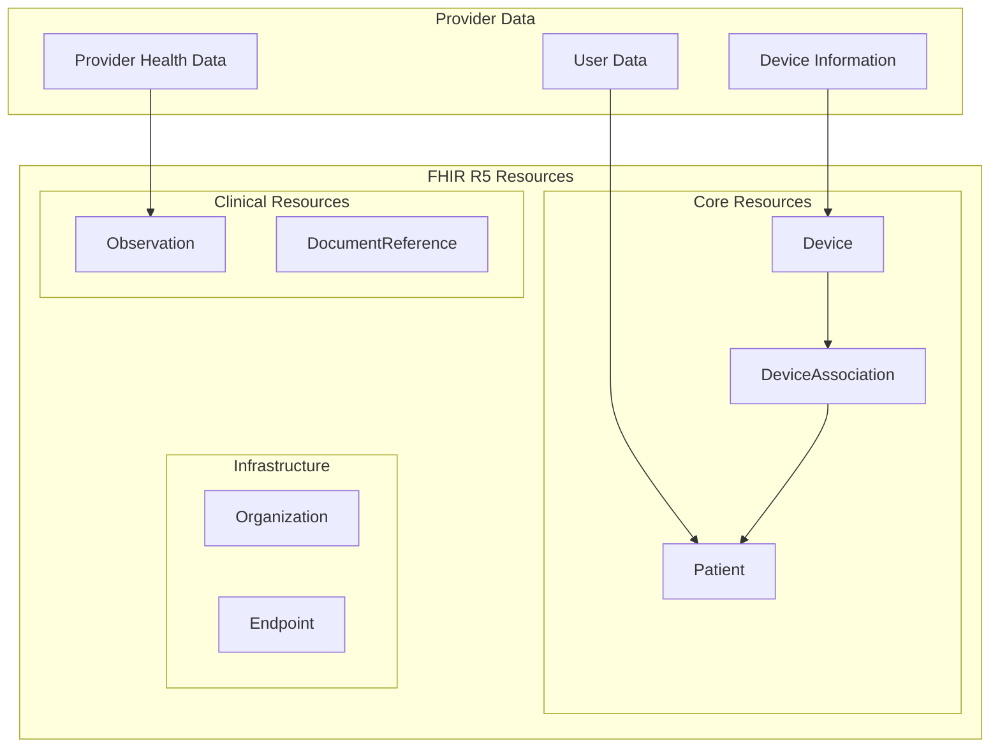
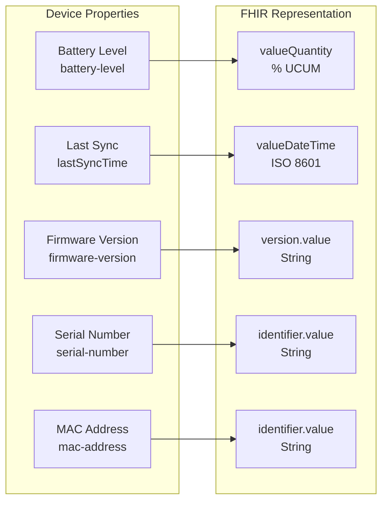
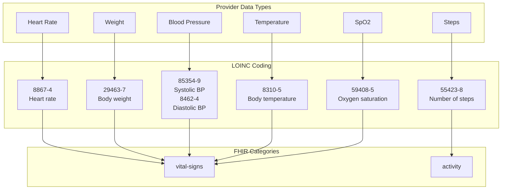
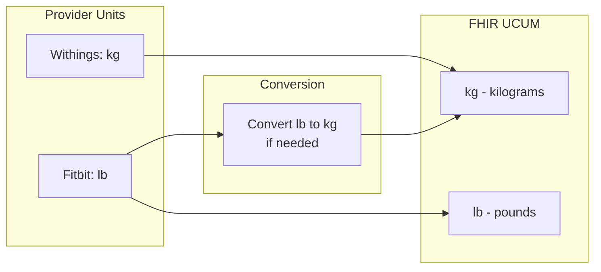
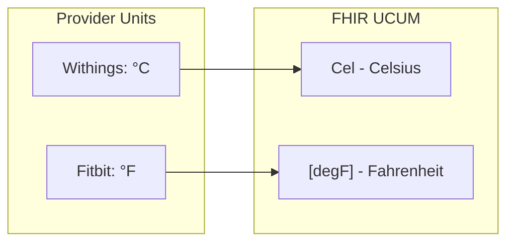
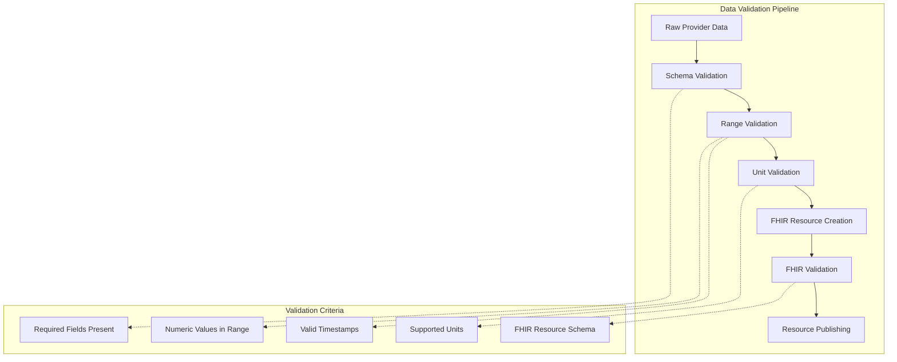
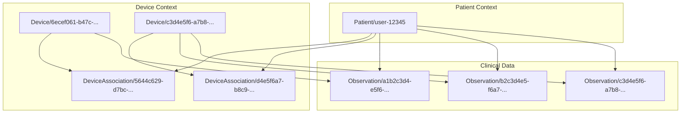
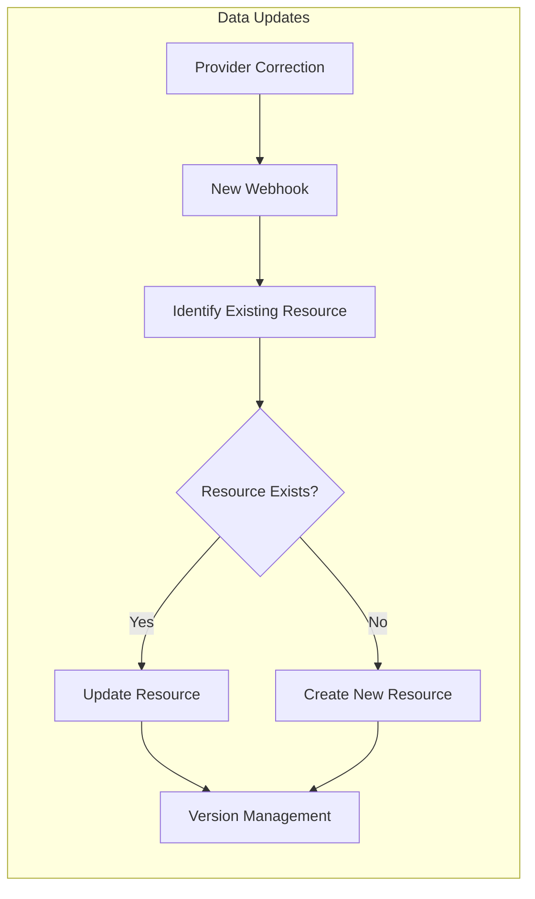

# FHIR R5 Mappings and Transformations

## Overview

Open Health Exchange transforms health data from various providers into FHIR R5-compliant resources. This document details the mapping specifications, coding systems, and transformation rules used to ensure healthcare interoperability.

## FHIR Resource Types


```mermaid
graph TB
    subgraph "Provider Data"
        PD[Provider Health Data]
        DD[Device Information]
        UD[User Data]
    end

    subgraph "FHIR R5 Resources"
        subgraph "Core Resources"
            PAT[Patient]
            DEV[Device]
            DA[DeviceAssociation]
        end

        subgraph "Clinical Resources"
            OBS[Observation]
            DOC[DocumentReference]
        end

        subgraph "Infrastructure"
            ORG[Organization]
            END[Endpoint]
        end
    end

    PD --> OBS
    DD --> DEV
    UD --> PAT
    DEV --> DA
    DA --> PAT
```

## Device Resources

### Device Resource Mapping

FHIR Device resources represent physical health monitoring devices and their capabilities.

```json
{
  "resourceType": "Device",
  "id": "6ecef061-b47c-5bf6-ac7f-5bc2590ab1f2",
  "identifier": [
    {
      "use": "official",
      "system": "https://api.withings.com/device-id",
      "value": "12345",
      "assigner": {
        "display": "Withings"
      }
    }
  ],
  "status": "active",
  "manufacturer": "Withings",
  "name": "Body+ Scale",
  "displayName": "Body+ Scale",
  "deviceName": [
    {
      "value": "Body+ Scale"
    }
  ],
  "type": [
    {
      "coding": [
        {
          "system": "http://snomed.info/sct",
          "code": "19892000",
          "display": "Scale"
        }
      ],
      "text": "Scale"
    }
  ],
  "version": [
    {
      "type": {
        "coding": [
          {
            "system": "http://terminology.hl7.org/CodeSystem/device-version-type",
            "code": "firmware-version",
            "display": "Firmware Version"
          }
        ]
      },
      "value": "2.1.0"
    }
  ],
  "property": [
    {
      "type": {
        "coding": [
          {
            "system": "http://terminology.hl7.org/CodeSystem/device-property-type",
            "code": "battery-level",
            "display": "Battery Level"
          }
        ]
      },
      "valueQuantity": {
        "value": 85,
        "unit": "%",
        "system": "http://unitsofmeasure.org",
        "code": "%"
      }
    }
  ],
  "safety": [
    {
      "coding": [
        {
          "system": "urn:oid:2.16.840.1.113883.3.26.1.1",
          "code": "mr-unsafe",
          "display": "MR Unsafe"
        }
      ]
    }
  ],
  "note": [
    {
      "time": "2023-12-07T10:30:00Z",
      "text": "Device synchronized from Withings Health Platform"
    }
  ]
}
```

### SNOMED CT Device Type Mappings

| Device Type | SNOMED CT Code | Display Name | Providers |
|-------------|----------------|--------------|-----------|
| Blood Pressure Monitor | 43770009 | Sphygmomanometer | Withings |
| Body Scale | 19892000 | Scale | Withings, Fitbit |
| Activity Tracker | 466093008 | Activity tracker | Withings, Fitbit |
| Smartwatch | 706767009 | Wearable device | Withings, Fitbit |
| Thermometer | 86184003 | Thermometer | Withings |
| Pulse Oximeter | 258185003 | Pulse oximeter | Fitbit |
| Unknown Device | 49062001 | Device | All (fallback) |

### Device Property Types


```mermaid
graph LR
    subgraph "Device Properties"
        BL[Battery Level<br/>battery-level]
        LS[Last Sync<br/>lastSyncTime]
        FW[Firmware Version<br/>firmware-version]
        SN[Serial Number<br/>serial-number]
        MAC[MAC Address<br/>mac-address]
    end

    subgraph "FHIR Representation"
        BL --> BQ[valueQuantity<br/>% UCUM]
        LS --> DT[valueDateTime<br/>ISO 8601]
        FW --> VE[version.value<br/>String]
        SN --> ID[identifier.value<br/>String]
        MAC --> ID2[identifier.value<br/>String]
    end
```

## DeviceAssociation Resources

DeviceAssociation resources link devices to patients and define the relationship context.

```json
{
  "resourceType": "DeviceAssociation",
  "id": "5644c629-d7bc-5ba5-ad81-4d38d3c9898f",
  "identifier": [
    {
      "use": "official",
      "system": "https://api.withings.com/device-association",
      "value": "12345",
      "assigner": {
        "display": "Withings"
      }
    }
  ],
  "device": {
    "reference": "Device/6ecef061-b47c-5bf6-ac7f-5bc2590ab1f2"
  },
  "category": [
    {
      "coding": [
        {
          "system": "http://hl7.org/fhir/device-association-category",
          "code": "home-use",
          "display": "Home Use"
        }
      ]
    }
  ],
  "status": {
    "coding": [
      {
        "system": "http://hl7.org/fhir/device-association-status",
        "code": "attached",
        "display": "Attached"
      }
    ]
  },
  "subject": {
    "reference": "Patient/67890"
  },
  "period": {
    "start": "2023-12-07T10:30:00Z"
  },
  "operator": [
    {
      "reference": "Patient/67890"
    }
  ],
  "operation": [
    {
      "status": {
        "coding": [
          {
            "system": "http://hl7.org/fhir/device-association-operation-status",
            "code": "active",
            "display": "Active"
          }
        ]
      },
      "operator": [
        {
          "reference": "Patient/67890"
        }
      ],
      "period": {
        "start": "2023-12-07T10:30:00Z"
      }
    }
  ]
}
```

## Observation Resources

### Health Data Observation Mapping


```mermaid
graph TB
    subgraph "Provider Data Types"
        HR[Heart Rate]
        ST[Steps]
        WT[Weight]
        BP[Blood Pressure]
        TM[Temperature]
        SP[SpO2]
    end

    subgraph "LOINC Coding"
        HR --> L1[8867-4<br/>Heart rate]
        ST --> L2[55423-8<br/>Number of steps]
        WT --> L3[29463-7<br/>Body weight]
        BP --> L4[85354-9<br/>Systolic BP<br/>8462-4<br/>Diastolic BP]
        TM --> L5[8310-5<br/>Body temperature]
        SP --> L6[59408-5<br/>Oxygen saturation]
    end

    subgraph "FHIR Categories"
        L1 --> C1[vital-signs]
        L2 --> C2[activity]
        L3 --> C1
        L4 --> C1
        L5 --> C1
        L6 --> C1
    end
```

### Heart Rate Observation Example

```json
{
  "resourceType": "Observation",
  "id": "a1b2c3d4-e5f6-5a7b-8c9d-0e1f2a3b4c5d",
  "identifier": [
    {
      "use": "secondary",
      "system": "https://api.withings.com/health-data",
      "value": "1234567890"
    }
  ],
  "status": "final",
  "category": [
    {
      "coding": [
        {
          "system": "http://terminology.hl7.org/CodeSystem/observation-category",
          "code": "vital-signs",
          "display": "Vital Signs"
        }
      ]
    }
  ],
  "code": {
    "coding": [
      {
        "system": "http://loinc.org",
        "code": "8867-4",
        "display": "Heart rate"
      }
    ],
    "text": "Heart rate"
  },
  "subject": {
    "reference": "Patient/67890"
  },
  "effectiveDateTime": "2023-12-07T10:30:00Z",
  "valueQuantity": {
    "value": 72,
    "unit": "beats/min",
    "system": "http://unitsofmeasure.org",
    "code": "/min"
  },
  "device": {
    "reference": "Device/6ecef061-b47c-5bf6-ac7f-5bc2590ab1f2"
  },
  "meta": {
    "source": "#withings",
    "tag": [
      {
        "system": "http://terminology.hl7.org/CodeSystem/v3-ObservationValue",
        "code": "auto-generated",
        "display": "Auto-generated"
      },
      {
        "system": "https://open-health-exchange.com/provider",
        "code": "withings",
        "display": "Withings"
      }
    ]
  }
}
```

### Steps Observation Example

```json
{
  "resourceType": "Observation",
  "id": "b2c3d4e5-f6a7-5b8c-9d0e-1f2a3b4c5d6e",
  "identifier": [
    {
      "use": "secondary",
      "system": "https://api.fitbit.com/health-data",
      "value": "9876543210"
    }
  ],
  "status": "final",
  "category": [
    {
      "coding": [
        {
          "system": "http://terminology.hl7.org/CodeSystem/observation-category",
          "code": "activity",
          "display": "Activity"
        }
      ]
    }
  ],
  "code": {
    "coding": [
      {
        "system": "http://loinc.org",
        "code": "55423-8",
        "display": "Number of steps"
      }
    ],
    "text": "Daily step count"
  },
  "subject": {
    "reference": "Patient/67890"
  },
  "effectivePeriod": {
    "start": "2023-12-07T00:00:00Z",
    "end": "2023-12-07T23:59:59Z"
  },
  "valueQuantity": {
    "value": 8542,
    "unit": "steps",
    "system": "http://unitsofmeasure.org",
    "code": "{steps}"
  },
  "device": {
    "reference": "Device/c3d4e5f6-a7b8-5c9d-0e1f-2a3b4c5d6e7f"
  },
  "meta": {
    "source": "#fitbit",
    "tag": [
      {
        "system": "http://terminology.hl7.org/CodeSystem/v3-ObservationValue",
        "code": "auto-generated",
        "display": "Auto-generated"
      },
      {
        "system": "https://open-health-exchange.com/provider",
        "code": "fitbit",
        "display": "Fitbit"
      }
    ]
  }
}
```

## LOINC Code Mappings

### Primary Health Data Types

| Data Type | LOINC Code | Display Name | UCUM Unit | FHIR Category |
|-----------|------------|--------------|-----------|---------------|
| Heart Rate | 8867-4 | Heart rate | /min | vital-signs |
| Steps | 55423-8 | Number of steps | {steps} | activity |
| Body Weight | 29463-7 | Body weight | kg, lb | vital-signs |
| BMI | 39156-5 | Body mass index | kg/m2 | vital-signs |
| Body Temperature | 8310-5 | Body temperature | Cel, [degF] | vital-signs |
| Systolic BP | 8480-6 | Systolic blood pressure | mm[Hg] | vital-signs |
| Diastolic BP | 8462-4 | Diastolic blood pressure | mm[Hg] | vital-signs |
| SpO2 | 59408-5 | Oxygen saturation in Arterial blood by Pulse oximetry | % | vital-signs |

### Extended Health Data Types

| Data Type | LOINC Code | Display Name | UCUM Unit | FHIR Category |
|-----------|------------|--------------|-----------|---------------|
| RR Intervals | 8637-1 | R-R interval | ms | vital-signs |
| Sleep Duration | 93832-4 | Sleep duration | h | activity |
| Energy Expenditure | 41981-2 | Calories burned | kcal | activity |
| Distance Walked | 41953-1 | Distance walked | m, km | activity |
| Body Fat Percentage | 41982-0 | Percentage body fat | % | vital-signs |
| Blood Glucose | 2339-0 | Glucose in Blood | mg/dL, mmol/L | laboratory |

## UCUM Unit Conversions

### Weight Units


```mermaid
graph LR
    subgraph "Provider Units"
        WKG[Withings: kg]
        FLB[Fitbit: lb]
    end

    subgraph "FHIR UCUM"
        UK[kg - kilograms]
        UL[lb - pounds]
    end

    subgraph "Conversion"
        WKG --> UK
        FLB --> C[Convert lb to kg<br/>if needed]
        C --> UK
        FLB --> UL
    end
```

### Temperature Units


```mermaid
graph LR
    subgraph "Provider Units"
        WC[Withings: °C]
        FF[Fitbit: °F]
    end

    subgraph "FHIR UCUM"
        UC[Cel - Celsius]
        UF["[degF] - Fahrenheit"]
    end

    WC --> UC
    FF --> UF
```

## Data Quality and Validation

### Validation Rules


```mermaid
graph TB
    subgraph "Data Validation Pipeline"
        A[Raw Provider Data] --> B[Schema Validation]
        B --> C[Range Validation]
        C --> D[Unit Validation]
        D --> E[FHIR Resource Creation]
        E --> F[FHIR Validation]
        F --> G[Resource Publishing]
    end

    subgraph "Validation Criteria"
        H[Required Fields Present]
        I[Numeric Values in Range]
        J[Valid Timestamps]
        K[Supported Units]
        L[FHIR Resource Schema]
    end

    B -.-> H
    C -.-> I
    C -.-> J
    D -.-> K
    F -.-> L
```

### Data Quality Checks

| Measurement Type | Valid Range | Units | Quality Checks |
|------------------|-------------|-------|----------------|
| Heart Rate | 30-220 bpm | /min | Physiologically plausible |
| Steps | 0-50000 | {steps} | Non-negative, daily maximum |
| Weight | 20-300 kg | kg, lb | Stable over time |
| Blood Pressure | Sys: 70-250, Dia: 40-150 | mm[Hg] | Systolic > Diastolic |
| Temperature | 35-42°C | Cel, [degF] | Fever detection |
| SpO2 | 70-100% | % | Medical alert thresholds |

## Provider-Specific Mappings

### Withings Data Transformations

```python
# Example Withings to FHIR transformation
withings_measurement = {
    "grpid": 12345,
    "attrib": 1,  # Weight
    "value": 70500,  # 70.5 kg (value in grams)
    "unit": -3,  # 10^-3 (grams to kg)
    "date": 1701942600
}

fhir_observation = {
    "resourceType": "Observation",
    "code": {
        "coding": [{
            "system": "http://loinc.org",
            "code": "29463-7",
            "display": "Body weight"
        }]
    },
    "valueQuantity": {
        "value": 70.5,  # Converted using unit
        "unit": "kg",
        "system": "http://unitsofmeasure.org",
        "code": "kg"
    },
    "effectiveDateTime": "2023-12-07T10:30:00Z"  # Converted from Unix timestamp
}
```

### Fitbit Data Transformations

```python
# Example Fitbit to FHIR transformation
fitbit_heart_rate = {
    "activities-heart": [{
        "dateTime": "2023-12-07",
        "value": {
            "customHeartRateZones": [],
            "heartRateZones": [
                {
                    "caloriesOut": 1102.3282,
                    "max": 94,
                    "min": 30,
                    "minutes": 1440,
                    "name": "Out of Range"
                }
            ],
            "restingHeartRate": 65
        }
    }]
}

fhir_observation = {
    "resourceType": "Observation",
    "code": {
        "coding": [{
            "system": "http://loinc.org",
            "code": "8867-4",
            "display": "Heart rate"
        }]
    },
    "valueQuantity": {
        "value": 65,
        "unit": "beats/min",
        "system": "http://unitsofmeasure.org",
        "code": "/min"
    },
    "effectiveDateTime": "2023-12-07T10:30:00Z"
}
```

## Resource Relationships

### FHIR Resource Reference Structure


```mermaid
graph TB
    subgraph "Patient Context"
        PAT[Patient/user-12345]
    end

    subgraph "Device Context"
        DEV1[Device/6ecef061-b47c-...]
        DEV2[Device/c3d4e5f6-a7b8-...]
        DA1[DeviceAssociation/5644c629-d7bc-...]
        DA2[DeviceAssociation/d4e5f6a7-b8c9-...]
    end

    subgraph "Clinical Data"
        OBS1[Observation/a1b2c3d4-e5f6-...]
        OBS2[Observation/b2c3d4e5-f6a7-...]
        OBS3[Observation/c3d4e5f6-a7b8-...]
    end

    PAT --> DA1
    PAT --> DA2
    DEV1 --> DA1
    DEV2 --> DA2
    DEV1 --> OBS1
    DEV2 --> OBS2
    DEV2 --> OBS3
    PAT --> OBS1
    PAT --> OBS2
    PAT --> OBS3
```

## Resource Identifier Strategy

### UUID Generation

All FHIR resources use deterministic UUID v5 identifiers for the `id` field. This ensures:

1. **Idempotency**: The same input data always produces the same UUID
2. **Uniqueness**: Different data produces different UUIDs
3. **Traceability**: Resources can be referenced consistently across systems

#### UUID Generation Formula

```python
# UUID v5 generation with DNS namespace
namespace = uuid.UUID("6ba7b810-9dad-11d1-80b4-00c04fd430c8")  # DNS namespace

# Device ID
device_uuid = uuid5(namespace, f"Device:{provider}:{provider_device_id}")
# Example: "Device:withings:12345" -> "6ecef061-b47c-5bf6-ac7f-5bc2590ab1f2"

# DeviceAssociation ID
association_uuid = uuid5(namespace, f"DeviceAssociation:{provider}:{provider_device_id}:{patient_id}")
# Example: "DeviceAssociation:withings:12345:patient-67890" -> "5644c629-d7bc-5ba5-ad81-4d38d3c9898f"

# Observation ID
observation_uuid = uuid5(namespace, f"Observation:{patient_id}:{timestamp_iso}:{loinc_code}")
# Example: "Observation:patient-123:2023-12-07T10:30:00+00:00:8867-4" -> "a1b2c3d4-e5f6-5a7b-8c9d-0e1f2a3b4c5d"
```

### Identifier Systems

| Resource Type | Identifier Use | System URL Template |
|---------------|----------------|---------------------|
| Device | `official` | `https://api.{provider}.com/device-id` |
| DeviceAssociation | `official` | `https://api.{provider}.com/device-association` |
| Observation | `secondary` | `https://api.{provider}.com/health-data` |

### Observation Identifier Generation

Observation identifiers support two strategies for backwards compatibility:

1. **Jenkins Hash (Legacy)**: Uses Jenkins One-at-a-Time hash for inwithings compatibility
   - Input: `{patient_id}:{datetime}:{loinc_code}`
   - Output: 32-bit integer as string (e.g., `"1234567890"`)

2. **Modern UUID**: Uses UUID v5 for deterministic identifiers
   - Input: `{patient_id}:{datetime}:{loinc_code}`
   - Output: UUID string (e.g., `"a1b2c3d4-e5f6-5a7b-8c9d-0e1f2a3b4c5d"`)

The strategy is configurable via `FHIR_COMPATIBILITY_CONFIG["IDENTIFIER_STRATEGY"]` setting.

## Legacy Mode (inwithings Compatibility)

Open Health Exchange supports a legacy compatibility mode for seamless integration with existing inwithings (Withings SOL) deployments. This mode ensures FHIR resources match the exact format produced by the legacy system.

### Configuration

Legacy mode is controlled via `FHIR_COMPATIBILITY_CONFIG` in `settings.py`:

```python
FHIR_COMPATIBILITY_CONFIG = {
    # Format mode: "legacy" (inwithings-compatible) or "modern" (FHIR R5 best practices)
    "FORMAT_MODE": "legacy",

    # Identifier generation: "jenkins_hash" (inwithings) or "modern" (UUID-based)
    "IDENTIFIER_STRATEGY": "jenkins_hash",

    # Observation status: "registered" (inwithings) or "final" (modern)
    "OBSERVATION_STATUS": "registered",

    # Include issued field with sync timestamp (inwithings behavior)
    "INCLUDE_ISSUED_FIELD": True,

    # Device info mode: "extension" (inwithings) or "reference" (separate Device resources)
    "DEVICE_INFO_MODE": "extension",

    # Include device-model extension
    "INCLUDE_DEVICE_MODEL_EXTENSION": True,

    # Bundle type: "batch" (inwithings, idempotent) or "transaction" (modern)
    "BUNDLE_TYPE": "batch",

    # Bundle method: "PUT" (inwithings, idempotent) or "POST" (modern)
    "BUNDLE_METHOD": "PUT",

    # Emit separate HR observation when ECG is processed
    "ECG_EMIT_SEPARATE_HR": True,

    # Enable observation linking via derivedFrom/hasMember
    "ENABLE_OBSERVATION_LINKING": True,

    # LOINC code overrides for backwards compatibility
    "LOINC_OVERRIDES": {
        "steps": "41950-7",  # inwithings uses 41950-7, modern uses 55423-8
    },

    # Use coded AFib interpretation (N/DET/IND) instead of valueString
    "ECG_AFIB_CODED_INTERPRETATION": True,

    # Identifier system URL template
    "IDENTIFIER_SYSTEM_TEMPLATE": "https://api.{provider}.com/health-data",
}
```

### Legacy vs Modern Mode Differences

#### LOINC Codes

| Data Type | Legacy (inwithings) | Modern |
|-----------|---------------------|--------|
| Steps | `41950-7` (Number of steps in 24 hour) | `55423-8` (Number of steps - Pedometer) |
| All other types | Same | Same |

#### Unit Encoding

| Measurement | Display | UCUM Code |
|-------------|---------|-----------|
| Temperature | `°C` | `Cel` |
| All other units | Same in both modes | Same in both modes |

> **Note:** Temperature uses the standard UCUM code `Cel` in all modes. While inwithings historically used non-standard encoding, OHE follows proper UCUM standards for better FHIR compliance.

#### Observation Structure

| Attribute | Legacy Mode | Modern Mode |
|-----------|-------------|-------------|
| `status` | `"registered"` | `"final"` |
| `issued` | Present (sync timestamp) | Omitted |
| Device info | Extensions on Observation | Separate Device reference |
| Identifier | Jenkins hash (32-bit integer) | UUID v5 |

#### Legacy Observation Extensions

In legacy mode, device information is stored as extensions on the Observation:

```json
{
  "resourceType": "Observation",
  "extension": [
    {
      "url": "obtained-from",
      "valueString": "withings"
    },
    {
      "url": "external-device-id",
      "valueString": "12345"
    },
    {
      "url": "device-model",
      "valueString": "ScanWatch"
    }
  ],
  "status": "registered",
  "issued": "2023-12-07T10:35:00Z"
}
```

#### Modern Observation Structure

In modern mode, device information uses standard FHIR references:

```json
{
  "resourceType": "Observation",
  "status": "final",
  "device": {
    "reference": "Device/6ecef061-b47c-5bf6-ac7f-5bc2590ab1f2"
  }
}
```

### Environment Variable Overrides

All legacy mode settings can be overridden via environment variables:

| Setting | Environment Variable | Default |
|---------|---------------------|---------|
| Format Mode | `FHIR_FORMAT_MODE` | `legacy` |
| Identifier Strategy | `FHIR_IDENTIFIER_STRATEGY` | `jenkins_hash` |
| Observation Status | `FHIR_OBSERVATION_STATUS` | `registered` |
| Include Issued | `FHIR_INCLUDE_ISSUED` | `true` |
| Device Info Mode | `FHIR_DEVICE_INFO_MODE` | `extension` |
| Bundle Type | `FHIR_BUNDLE_TYPE` | `batch` |
| Bundle Method | `FHIR_BUNDLE_METHOD` | `PUT` |
| Steps LOINC Override | `FHIR_LOINC_STEPS` | `41950-7` |

### Migration to Modern Mode

To switch from legacy to modern mode:

```bash
# Set environment variables for modern mode
export FHIR_FORMAT_MODE=modern
export FHIR_IDENTIFIER_STRATEGY=modern
export FHIR_OBSERVATION_STATUS=final
export FHIR_INCLUDE_ISSUED=false
export FHIR_DEVICE_INFO_MODE=reference
export FHIR_BUNDLE_TYPE=transaction
export FHIR_BUNDLE_METHOD=POST
export FHIR_LOINC_STEPS=55423-8
```

> **Warning:** Switching modes will change resource identifiers and structure. Ensure downstream systems are prepared for the new format before migrating.

## Error Handling and Data Quality

### Missing Data Handling

| Scenario | Strategy | FHIR Representation |
|----------|----------|---------------------|
| Missing measurement value | Skip observation | No resource created |
| Missing timestamp | Use sync time | effectiveDateTime = sync timestamp |
| Missing device info | Use generic device | Device with minimal info |
| Invalid units | Convert or reject | Standard UCUM units or rejection |

### Data Correction and Updates


```mermaid
graph LR
    subgraph "Data Updates"
        A[Provider Correction] --> B[New Webhook]
        B --> C[Identify Existing Resource]
        C --> D{Resource Exists?}
        D -->|Yes| E[Update Resource]
        D -->|No| F[Create New Resource]
        E --> G[Version Management]
        F --> G
    end
```

This comprehensive FHIR mapping ensures that health data from different providers is consistently represented using healthcare industry standards, enabling seamless integration with any FHIR R5-compliant EHR system.
