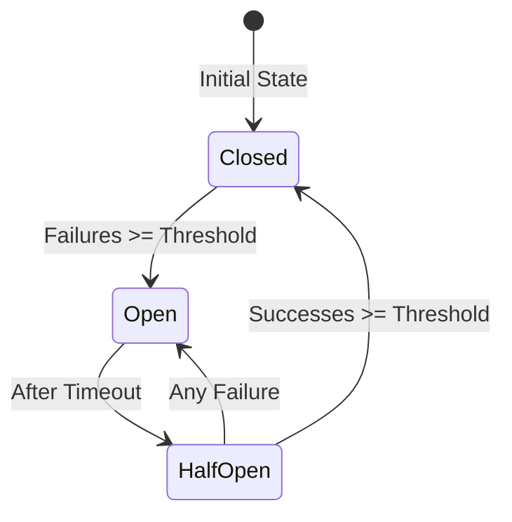

# Monitoring and Operations Guide

## Overview

This guide covers the monitoring, observability, and operational features of Open Health Exchange (some items may still be marked *Planned* if not implemented). The system provides health checks, metrics collection, structured logging, and fully implemented circuit breakers for external provider calls.

## Table of Contents

1. [Health Monitoring](#health-monitoring)
2. [Prometheus Metrics](#prometheus-metrics)
3. [Circuit Breakers](#circuit-breakers)
4. [Error Handling](#error-handling)
5. [Structured Logging](#structured-logging)
6. [Operational Procedures](#operational-procedures)
7. [Alerting Configuration](#alerting-configuration)
8. [Performance Tuning](#performance-tuning)

## Health Monitoring

### Health Check Endpoints

The system provides multiple health check endpoints for different monitoring scenarios:

#### Comprehensive Health Check
- **Endpoint**: `GET /api/metrics/health/`
- **Purpose**: Full system health assessment
- **Checks**: Database, Redis, Huey queue
- **Response Time**: Each component's response time included
- **Use Case**: Load balancer health checks, monitoring dashboards

```bash
# Check system health
curl -s http://localhost:8000/api/metrics/health/ | jq .

# Monitor continuously
watch -n 5 "curl -s http://localhost:8000/api/metrics/health/ | jq .status"
```

#### Kubernetes Readiness Probe
- **Endpoint**: `GET /api/metrics/ready/`
- **Purpose**: Determine if the service can handle traffic
- **Checks**: Database and Redis availability
- **Use Case**: Kubernetes readiness probe configuration

```yaml
# Kubernetes deployment configuration
readinessProbe:
  httpGet:
    path: /api/metrics/ready/
    port: 8000
  initialDelaySeconds: 10
  periodSeconds: 5
  timeoutSeconds: 3
  successThreshold: 1
  failureThreshold: 3
```

#### Kubernetes Liveness Probe
- **Endpoint**: `GET /api/metrics/live/`
- **Purpose**: Detect if the application needs restart
- **Checks**: Basic application responsiveness
- **Use Case**: Kubernetes liveness probe configuration

```yaml
# Kubernetes deployment configuration
livenessProbe:
  httpGet:
    path: /api/metrics/live/
    port: 8000
  initialDelaySeconds: 30
  periodSeconds: 10
  timeoutSeconds: 3
  failureThreshold: 3
```

### Health Check Response Codes

| Status Code | Meaning | Action Required |
|------------|---------|-----------------|
| 200 | All checks passed | None |
| 503 | One or more checks failed | Investigate failed components |

### Monitoring Health Status

```python
# Python script to monitor health
import requests
import time
import json

def monitor_health(url="http://localhost:8000/api/metrics/health/"):
    while True:
        try:
            response = requests.get(url, timeout=5)
            data = response.json()

            if data['status'] == 'healthy':
                print(f"✅ System healthy - Response time: {data['response_time_ms']}ms")
            else:
                print(f"⚠️  System unhealthy!")
                for check, status in data['checks'].items():
                    if status.get('status') != 'healthy':
                        print(f"  ❌ {check}: {status.get('error', 'unhealthy')}")
        except Exception as e:
            print(f"❌ Health check failed: {e}")

        time.sleep(5)

if __name__ == "__main__":
    monitor_health()
```

## Prometheus Metrics

### Available Metrics

The application exposes the following Prometheus metrics at `/api/metrics/metrics/`:

#### Sync Operations Metrics
- `ohe_sync_operations_total`: Counter of sync operations by provider, type, and status
- `ohe_sync_duration_seconds`: Histogram of sync operation durations
- `ohe_data_points_processed_total`: Counter of processed health data points

#### API Metrics
- `ohe_api_requests_total`: Counter of API requests by method, endpoint, and status code
- `ohe_api_request_duration_seconds`: Histogram of API request durations

#### Provider Metrics
- `ohe_provider_api_errors_total`: Counter of provider API errors by type
- `ohe_provider_api_rate_limits_total`: Counter of rate limit hits by provider
- `ohe_webhook_requests_total`: Counter of webhook requests by provider
- `ohe_webhook_processing_time_seconds`: Histogram of webhook processing times

#### System Metrics
- `ohe_database_connections`: Gauge of active database connections
- `ohe_redis_connections`: Gauge of active Redis connections
- `ohe_huey_queue_size`: Gauge of tasks in Huey queue

### Prometheus Configuration

```yaml
# prometheus.yml
scrape_configs:
  - job_name: 'open-health-exchange'
    static_configs:
      - targets: ['localhost:8000']
    metrics_path: '/api/metrics/metrics/'
    scrape_interval: 30s
    scrape_timeout: 10s
```

### Grafana Dashboard Example

```json
{
  "dashboard": {
    "title": "Open Health Exchange Monitoring",
    "panels": [
      {
        "title": "Sync Success Rate",
        "targets": [{
          "expr": "rate(ohe_sync_operations_total{status='success'}[5m]) / rate(ohe_sync_operations_total[5m]) * 100"
        }]
      },
      {
        "title": "API Request Rate",
        "targets": [{
          "expr": "rate(ohe_api_requests_total[1m])"
        }]
      },
      {
        "title": "Provider API Errors",
        "targets": [{
          "expr": "increase(ohe_provider_api_errors_total[1h])"
        }]
      },
      {
        "title": "Queue Size",
        "targets": [{
          "expr": "ohe_huey_queue_size"
        }]
      }
    ]
  }
}
```

## Circuit Breakers

### Configuration

Circuit breakers protect against cascading failures when external services are unavailable or consistently erroring. They short-circuit outbound calls after repeated failures, allowing the system to degrade gracefully and recover automatically.

| Provider | Failure Threshold | Success Threshold | Timeout |
|----------|------------------|-------------------|---------|
| Withings | 3 failures | 2 successes | 30s |
| Fitbit | 3 failures | 2 successes | 30s |
| FHIR Server | 5 failures | 3 successes | 60s |

### Circuit Breaker States



### Monitoring Circuit Breakers

```python
from ingestors.circuit_breaker import registry

def dump_breakers():
  states = registry.get_all_states()
  for name, info in states.items():
    print(
      f"{name}: state={info['state']} failures={info['failure_count']} "
      f"opened_at={info['opened_at']} last_failure={info['last_failure_at']}"
    )

dump_breakers()

# Administrative override (emergency): force close a breaker
registry.get_breaker("withings_api").force_close()
```

Operational guidance:
- Investigate upstream outage BEFORE force-closing an open breaker.
- If a provider recovers early, you may manually force-close to resume traffic sooner.
- Persistent half-open oscillation usually indicates intermittent upstream instability.

### Circuit Breaker Metrics

Current metrics piggyback on existing error counters (e.g. `ohe_provider_api_errors_total{error_type="circuit_breaker"}`). A dedicated gauge per breaker is a planned enhancement (e.g. `ohe_circuit_breaker_state{breaker="withings_api",state="open"} 1`).

Suggested interim Prometheus queries:
```promql
# Estimated open event frequency
increase(ohe_provider_api_errors_total{error_type="circuit_breaker"}[30m])

# Provider error ratio (all error types)
sum(rate(ohe_provider_api_errors_total[5m])) by (provider) /
sum(rate(ohe_sync_operations_total[5m])) by (provider)
```

Planned metrics (future):
- Gauge: `ohe_circuit_breaker_state{breaker=...,state=...}`
- Counter: `ohe_circuit_breaker_transitions_total{breaker=...,from=...,to=...}`
- Histogram: `ohe_circuit_breaker_open_duration_seconds`

## Error Handling

### Error Classification

The system automatically classifies errors into categories:

| Error Type | Examples | Retryable | Action |
|------------|----------|-----------|---------|
| `api_error` | 500, Internal Server Error | Yes | Retry with backoff |
| `auth_error` | 401, Token expired | No | Refresh token or re-auth |
| `rate_limit_error` | 429, Too Many Requests | Yes | Wait and retry |
| `network_error` | Timeout, Connection refused | Yes | Retry with backoff |
| `validation_error` | 400, Invalid parameters | No | Fix request parameters |

### Retry Configuration

```python
# Default retry configuration
from ingestors.error_handling import RetryHandler

# Conservative retry for critical operations
critical_retry = RetryHandler(
    max_retries=5,
    base_delay=2.0,
    max_delay=60.0,
    backoff_factor=2.0
)

# Aggressive retry for non-critical operations
quick_retry = RetryHandler(
    max_retries=2,
    base_delay=0.5,
    max_delay=5.0,
    backoff_factor=1.5
)
```

### Error Monitoring

```promql
# Error rate by type
sum by (error_type) (rate(ohe_provider_api_errors_total[5m]))

# Most common errors in last hour
topk(5, increase(ohe_provider_api_errors_total[1h]))

# Auth failure rate
rate(ohe_provider_api_errors_total{error_type="auth_error"}[5m])
```

## Structured Logging

### Log Format

Production logs use JSON format for easy parsing and analysis:

```json
{
  "timestamp": "2025-09-24T10:15:30Z",
  "level": "ERROR",
  "logger": "ingestors.api_clients",
  "module": "api_clients",
  "message": "Failed to fetch health data",
  "user_id": "user-12345",
  "provider": "withings",
  "operation": "heart_rate_fetch",
  "duration": 1.234,
  "error_type": "rate_limit_error",
  "process_id": 1234,
  "thread_id": 5678,
  "traceback": ["..."]
}
```

### Log Aggregation

#### Using CloudWatch Insights
```sql
-- Find all errors for a specific user
fields @timestamp, message, error_type
| filter user_id = "user-12345"
| filter level = "ERROR"
| sort @timestamp desc
| limit 50

-- Analyze sync operation performance
fields @timestamp, operation, duration
| filter logger = "ingestors.orchestrator"
| stats avg(duration) as avg_duration, max(duration) as max_duration by operation
```

#### Using Elasticsearch/Kibana
```json
{
  "query": {
    "bool": {
      "must": [
        {"term": {"level": "ERROR"}},
        {"term": {"provider": "fitbit"}},
        {"range": {"timestamp": {"gte": "now-1h"}}}
      ]
    }
  },
  "aggs": {
    "error_types": {
      "terms": {"field": "error_type"}
    }
  }
}
```

### Log Levels

Configure log levels per module:

```python
# settings.py
LOGGING = {
    "loggers": {
        "ingestors": {"level": "INFO"},     # Normal operations
        "webhooks": {"level": "INFO"},      # Webhook processing
        "metrics": {"level": "WARNING"},    # Only important issues
        "transformers": {"level": "DEBUG"}, # Detailed debugging
    }
}
```

## Operational Procedures

### Daily Health Checks

1. **Morning Check (9 AM)**
   ```bash
   # Check system health
   curl http://localhost:8000/api/metrics/health/

   # Check queue size
   echo "SELECT COUNT(*) FROM huey_task;" | psql open_health_exchange

   # Check error rate in last 12 hours
   curl -s http://localhost:8000/api/metrics/metrics/ | grep error
   ```

2. **Sync Status Review**
   ```python
   # Check recent sync operations
   from ingestors.models import SyncStatus
   from datetime import datetime, timedelta

   recent_syncs = SyncStatus.objects.filter(
       created_at__gte=datetime.now() - timedelta(hours=24)
   )

   success_rate = recent_syncs.filter(status='success').count() / recent_syncs.count()
   print(f"24h success rate: {success_rate:.2%}")
   ```

### Troubleshooting Guide

#### High Error Rate
1. Check circuit breaker states
2. Review error logs for patterns
3. Check provider API status pages
4. Verify OAuth tokens are valid
5. Check rate limit metrics

#### Slow Performance
1. Check queue size (`ohe_huey_queue_size`)
2. Review sync duration metrics
3. Check database connection pool
4. Verify Redis performance
5. Scale workers if needed

#### Authentication Failures
1. Check token expiry times
2. Verify OAuth credentials
3. Test token refresh mechanism
4. Review provider-specific auth logs

### Emergency Procedures

#### Circuit Breaker Manual Control
```python
from ingestors.circuit_breaker import registry

# Emergency: Force close all circuit breakers
registry.reset_all()

# Disable specific provider temporarily
registry.get_breaker("fitbit_api").force_open()
```

#### Queue Management
```bash
# Clear stuck tasks (use with caution!)
redis-cli DEL huey.default

# Pause task processing
supervisorctl stop huey_worker

# Resume task processing
supervisorctl start huey_worker
```

## Alerting Configuration

### Critical Alerts

```yaml
# AlertManager configuration
groups:
  - name: ohe_critical
    rules:
      - alert: HighErrorRate
        expr: rate(ohe_provider_api_errors_total[5m]) > 0.1
        for: 5m
        annotations:
          summary: "High error rate detected"

      - alert: CircuitBreakerOpen
        expr: ohe_circuit_breaker_state{state="open"} == 1
        for: 10m
        annotations:
          summary: "Circuit breaker open for {{ $labels.provider }}"

      - alert: QueueBacklog
        expr: ohe_huey_queue_size > 1000
        for: 15m
        annotations:
          summary: "Large queue backlog detected"
```

### Warning Alerts

```yaml
groups:
  - name: ohe_warnings
    rules:
      - alert: SlowSyncOperations
        expr: histogram_quantile(0.95, ohe_sync_duration_seconds) > 30
        for: 10m
        annotations:
          summary: "Sync operations running slowly"

      - alert: RateLimitApproaching
        expr: increase(ohe_provider_api_rate_limits_total[1h]) > 10
        annotations:
          summary: "Approaching rate limits for {{ $labels.provider }}"
```

## Performance Tuning

### Database Optimization

```sql
-- Add indexes for common queries
CREATE INDEX idx_provider_link_user ON base_providerlink(ehr_user_id);
CREATE INDEX idx_sync_status_created ON sync_status(created_at);

-- Connection pool tuning (settings.py)
DATABASES['default']['CONN_MAX_AGE'] = 600
DATABASES['default']['OPTIONS'] = {
    'connect_timeout': 10,
    'options': '-c statement_timeout=30000'
}
```

### Redis Optimization

```python
# settings.py
redis_pool = redis.ConnectionPool(
    max_connections=50,        # Increase for high load
    socket_keepalive=True,
    socket_keepalive_options={
        1: 1,  # TCP_KEEPIDLE
        2: 1,  # TCP_KEEPINTVL
        3: 3,  # TCP_KEEPCNT
    }
)
```

### Worker Scaling

```yaml
# Kubernetes HPA configuration
apiVersion: autoscaling/v2
kind: HorizontalPodAutoscaler
metadata:
  name: huey-worker-hpa
spec:
  scaleTargetRef:
    apiVersion: apps/v1
    kind: Deployment
    name: huey-worker
  minReplicas: 2
  maxReplicas: 10
  metrics:
    - type: Pods
      pods:
        metric:
          name: queue_size
        target:
          type: AverageValue
          averageValue: "100"
```

### Rate Limiting Optimization

```python
# Adaptive rate limiting based on provider response
from ingestors.api_clients import APIClientConfig

# Conservative during business hours
business_hours_config = APIClientConfig(
    max_requests_per_window=100,
    rate_limit_window=60
)

# Aggressive during off-hours
off_hours_config = APIClientConfig(
    max_requests_per_window=250,
    rate_limit_window=60
)
```

## Monitoring Best Practices

1. **Set up dashboards** for key metrics (success rate, error rate, latency)
2. **Configure alerts** for critical issues (circuit breakers, high error rates)
3. **Regular reviews** of sync performance and error patterns
4. **Capacity planning** based on queue size and processing time trends
5. **Documentation** of all incidents and resolutions
6. **Testing** of emergency procedures in staging environment

## Support and Troubleshooting

For additional support:
- Check application logs: `kubectl logs -f deployment/open-health-exchange`
- Review metrics dashboard: `http://grafana.example.com/dashboard/ohe`
- Monitor health status: `curl http://api.example.com/api/metrics/health/`
- Report issues: [GitHub Issues](https://github.com/avimedical/open-health-exchange/issues)