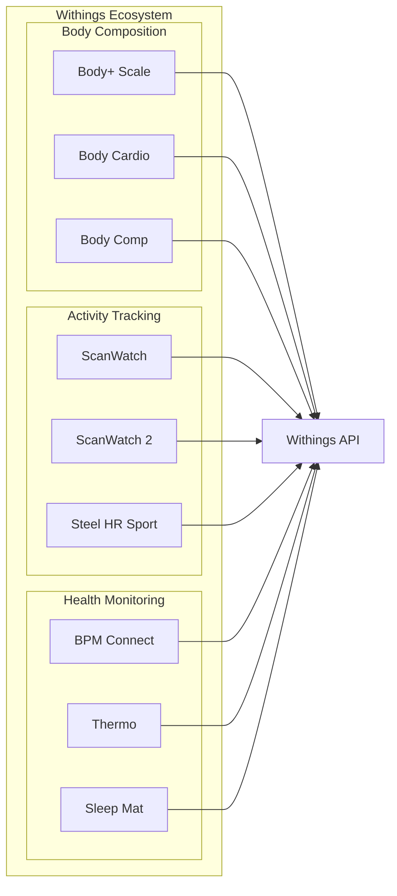
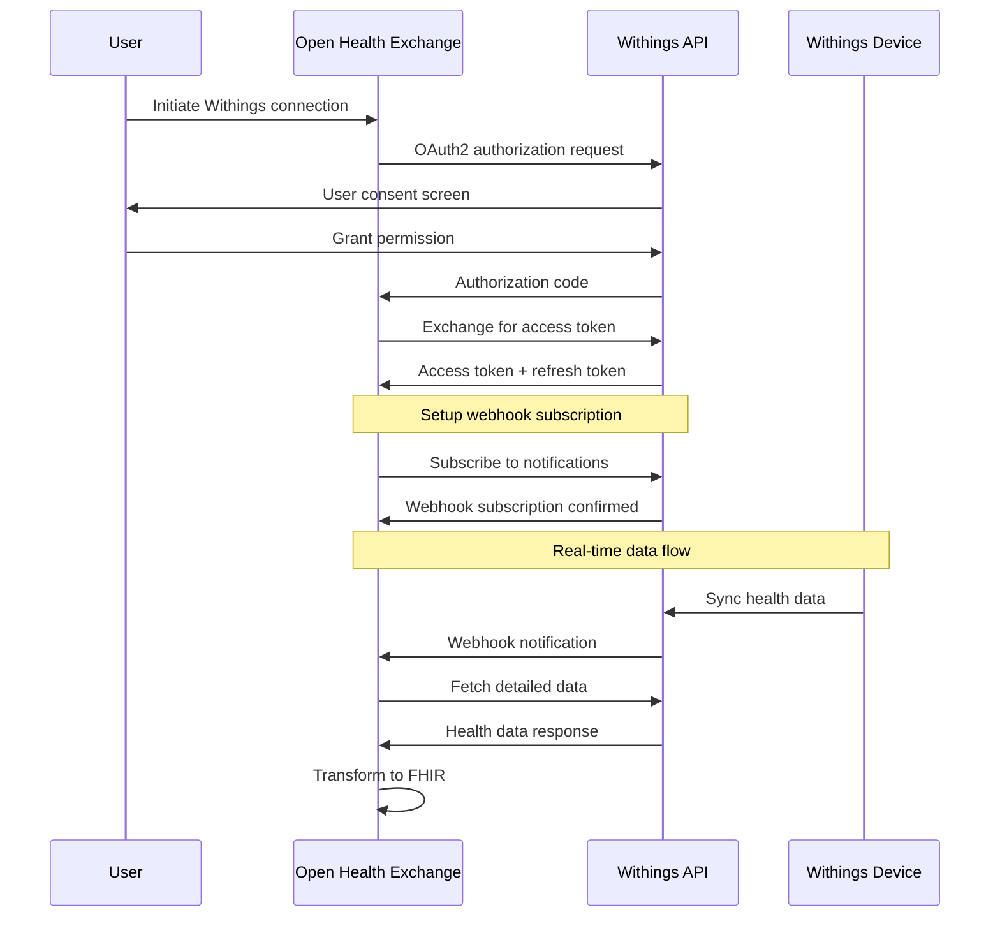
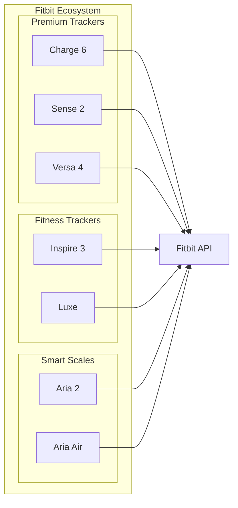
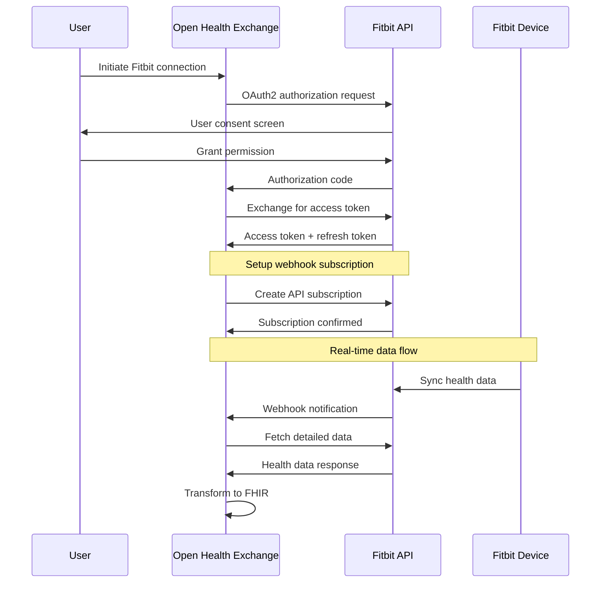
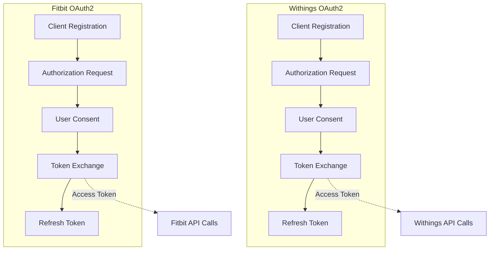
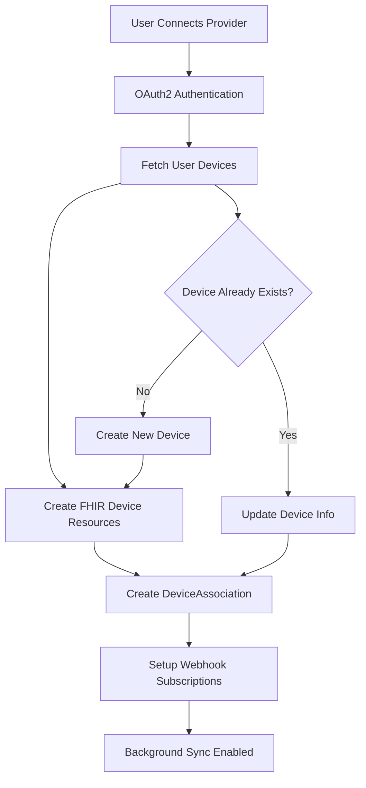
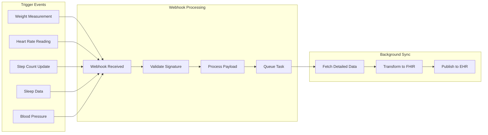
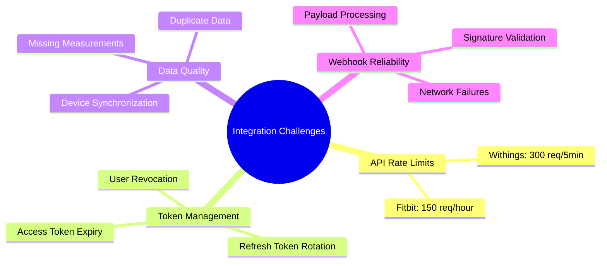
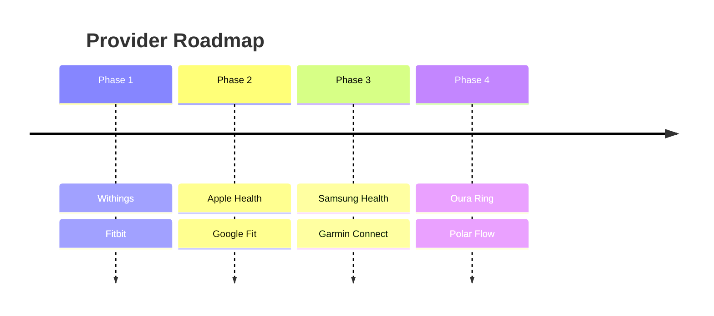

# Supported Providers and Devices

## Overview

Open Health Exchange currently supports two major health data providers: **Withings** and **Fitbit**. Each provider offers different device types and health data capabilities.

## Provider Support Matrix

| Provider | OAuth2 | Webhooks | Device Sync | Health Data | Status |
|----------|--------|----------|-------------|-------------|--------|
| Withings | ✅ | ✅ | ✅ | ✅ | Production Ready |
| Fitbit   | ✅ | ✅ | ✅ | ✅ | Production Ready |

## Withings Integration

### Supported Devices



### Device Categories and Data Types

| Device Type | SNOMED CT Code | Data Types Supported | FHIR Resource |
|-------------|----------------|---------------------|---------------|
| **Body Scale** | 19892000 (Scale) | Weight, BMI, Fat %, Muscle Mass | Observation |
| **Activity Tracker** | 466093008 (Activity tracker) | Steps, Heart Rate, Sleep | Observation |
| **Smartwatch** | 706767009 (Wearable device) | Heart Rate, RR Intervals, ECG | Observation |
| **Blood Pressure Monitor** | 43770009 (Sphygmomanometer) | Systolic/Diastolic BP, Pulse | Observation |
| **Thermometer** | 86184003 (Thermometer) | Body Temperature | Observation |

### Withings API Integration



### Withings Data Mapping

| Withings Data Type | Application ID | LOINC Code | FHIR Category |
|-------------------|----------------|------------|---------------|
| Heart Rate | 4, 44 | 8867-4 | vital-signs |
| Steps | 4 | 55423-8 | activity |
| Weight | 1 | 29463-7 | vital-signs |
| Blood Pressure | 46 | 85354-9 (Systolic), 8462-4 (Diastolic) | vital-signs |
| Body Temperature | 12 | 8310-5 | vital-signs |
| RR Intervals | 44 | 80404-7 | vital-signs |
| ECG | 50 | 131328-5 | procedure |

## Fitbit Integration

### Supported Devices



### Device Categories and Data Types

| Device Type | SNOMED CT Code | Data Types Supported | FHIR Resource |
|-------------|----------------|---------------------|---------------|
| **Fitness Tracker** | 466093008 (Activity tracker) | Steps, Heart Rate, Sleep, Activity | Observation |
| **Smartwatch** | 706767009 (Wearable device) | Heart Rate, ECG, SpO2, Stress | Observation |
| **Smart Scale** | 19892000 (Scale) | Weight, BMI, Body Fat % | Observation |

### Fitbit API Integration



### Fitbit Data Mapping

| Fitbit Collection Type | LOINC Code | FHIR Category | Description |
|------------------------|------------|---------------|-------------|
| activities | 55423-8 | activity | Steps, distance, calories |
| heart | 8867-4 | vital-signs | Heart rate zones, resting HR |
| sleep | 93832-4 | activity | Sleep stages, duration |
| body | 29463-7 | vital-signs | Weight, BMI, body fat |
| spo2 | 2708-6 | vital-signs | Blood oxygen saturation |

## Authentication and Authorization

### OAuth2 Flow Comparison



### Required Scopes

#### Withings Scopes
- `user.info`: Basic user information
- `user.metrics`: Health measurements
- `user.activity`: Activity and exercise data

#### Fitbit Scopes
- `activity`: Steps, distance, calories, active minutes
- `heartrate`: Heart rate data
- `location`: GPS data (if needed)
- `nutrition`: Food and water logging
- `profile`: Basic profile information
- `settings`: User preferences
- `sleep`: Sleep logs
- `social`: Friends and leaderboards
- `weight`: Body weight and BMI

## Device Discovery and Management

### Device Registration Flow



### Device Properties Tracked

| Property | Withings | Fitbit | FHIR Mapping |
|----------|----------|--------|--------------|
| Device ID | ✅ | ✅ | identifier.value |
| Model Name | ✅ | ✅ | name |
| Battery Level | ✅ | ✅ | property.battery-level |
| Firmware Version | ✅ | ✅ | version.value |
| Last Sync Time | ✅ | ✅ | property.lastSyncTime |
| MAC Address | ❌ | ✅ | identifier.value (secondary) |
| Serial Number | ❌ | ❌ | identifier.value (if available) |

## Data Synchronization Patterns

### Real-Time Webhook Triggers



### Data Freshness and Timing

| Provider | Webhook Latency | Data Freshness | Retry Policy |
|----------|----------------|----------------|--------------|
| Withings | < 5 minutes | Near real-time | 3 retries with exponential backoff |
| Fitbit | < 15 minutes | Near real-time | 3 retries with exponential backoff |

## Error Handling and Limitations

### Common Integration Challenges



### Error Recovery Strategies

| Error Type | Withings | Fitbit | Recovery Strategy |
|------------|----------|--------|-------------------|
| Rate Limit | 429 HTTP | 429 HTTP | Exponential backoff, queue tasks |
| Auth Failure | 401 HTTP | 401 HTTP | Refresh token, re-authenticate user |
| Network Error | Timeout | Timeout | Retry with circuit breaker |
| Invalid Data | Parse Error | Parse Error | Log error, skip record |

## Future Provider Support

### Planned Integrations



### Extension Framework

The system is designed to easily support new providers through:

1. **Provider Registration**: Add new provider configuration
2. **OAuth2 Backend**: Implement provider-specific authentication
3. **API Client**: Create provider API integration
4. **Data Mapping**: Define FHIR transformation rules
5. **Webhook Handler**: Process provider notifications

### Adding New Providers

```python
# Example provider configuration
PROVIDER_CONFIGS = {
    Provider.NEW_PROVIDER: ProviderConfig(
        name=Provider.NEW_PROVIDER,
        client_id_setting="SOCIAL_AUTH_NEWPROVIDER_KEY",
        client_secret_setting="SOCIAL_AUTH_NEWPROVIDER_SECRET",
        api_base_url="https://api.newprovider.com",
        device_endpoint="/v1/devices",
        device_types_map={
            "tracker": DeviceType.ACTIVITY_TRACKER,
            "scale": DeviceType.SCALE,
        }
    )
}
```

This extensible architecture ensures that adding new health data providers follows a consistent pattern and maintains compatibility with the existing FHIR integration.