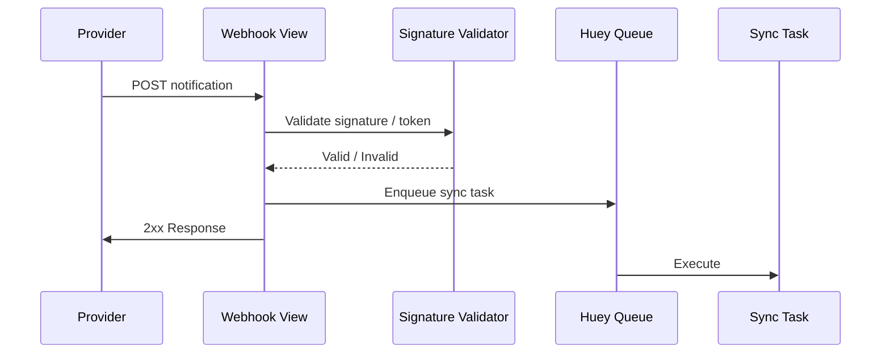

# Webhooks

This document describes how provider webhooks are received, validated, and processed.

## Current Providers

| Provider | Endpoint | View | Signature Validation | Response |
|----------|----------|------|----------------------|----------|
| Withings | `/api/webhooks/withings/` | `withings_webhook_handler` | HMAC (shared secret) | 200 JSON {"status": "accepted"} |
| Fitbit   | `/api/webhooks/fitbit/`   | `fitbit_webhook_handler`   | Verification token + (Planned HMAC) | 204 No Content |

## Processing Flow

## Security

- Strict method: POST only
- Signature/token validation per provider
- Planned: Timestamp tolerance & replay prevention
- Planned: Unified HMAC for all providers

## Error Handling

| Case | Action |
|------|--------|
| Invalid signature | 403 response |
| Missing fields | 400 response |
| Internal error | 500 logged, no provider retry suppression |

## Planned Enhancements

1. Replay protection using Redis nonce store
2. Provider-agnostic signature abstraction layer
3. Metrics: `ohe_webhook_validation_failures_total`
4. Batch notification coalescing for burst traffic
5. Async streaming ingestion for large payloads

## Fitbit 204 Body Note

Current implementation returns HTTP 204 with an empty body for Fitbit. If Fitbit later requires a JSON acknowledgement, update the view accordingly. (Tracked in Phase 2 docs tasks.)
