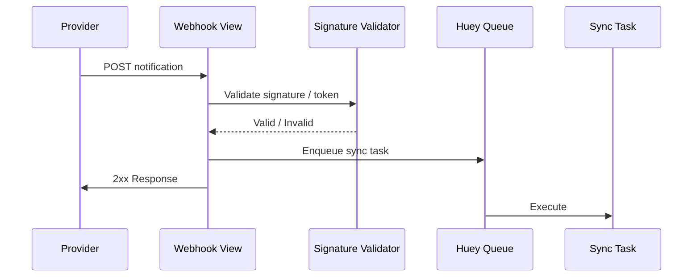

# Webhooks

This document describes how provider webhooks are received, validated, and processed.

## Current Providers

| Provider | Endpoint | View | Signature Validation | Response |
|----------|----------|------|----------------------|----------|
| Withings | `/webhooks/withings/` | `withings_webhook_handler` | HMAC (shared secret) | 202 JSON {"status": "accepted"} |
| Fitbit   | `/webhooks/fitbit/`   | `fitbit_webhook_handler`   | Verification token + HMAC | 202 JSON {"status": "accepted"} |

**Note:** A legacy Fitbit endpoint `/api/ingestors/fitbit/notifications/` is also available for backward compatibility with existing Fitbit Developer Portal configurations.

## Processing Flow

```mermaid
sequenceDiagram
    participant P as Provider
    participant W as Webhook View
    participant V as Signature Validator
    participant Q as Huey Queue
    participant S as Sync Task

    P->>W: POST notification
    W->>V: Validate signature / token
    V-->>W: Valid / Invalid
    W->>Q: Enqueue sync task
    W->>P: 2xx Response
    Q->>S: Execute
```

## Security

- Strict method: POST only
- Signature/token validation per provider
- Planned: Timestamp tolerance & replay prevention
- Planned: Unified HMAC for all providers

## Error Handling

| Case | Action |
|------|--------|
| Invalid signature | 403 response |
| Missing fields | 400 response |
| Internal error | 500 logged, no provider retry suppression |

## Planned Enhancements

1. Replay protection using Redis nonce store
2. Provider-agnostic signature abstraction layer
3. Metrics: `ohe_webhook_validation_failures_total`
4. Batch notification coalescing for burst traffic
5. Async streaming ingestion for large payloads

## Fitbit Verification Note

Fitbit webhook verification (GET requests with `?verify=<code>`) returns HTTP 204 No Content on success. Notification POST requests return HTTP 202 Accepted with a JSON response body, consistent with the Withings handler.
